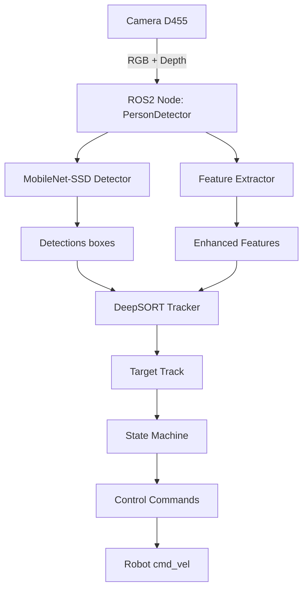
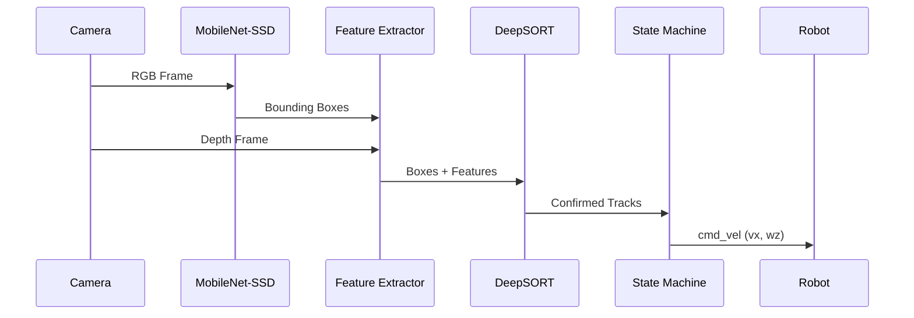
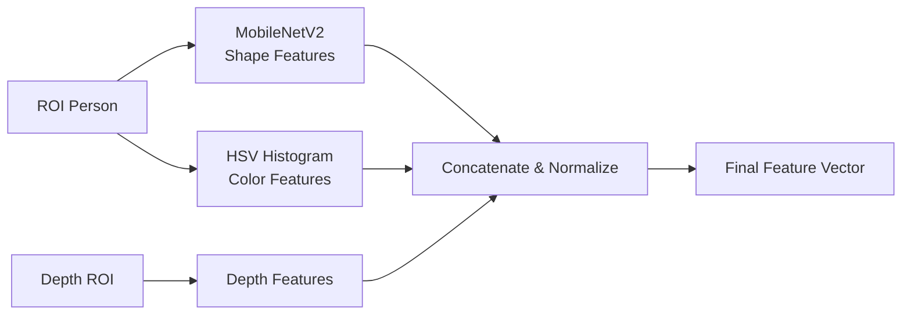
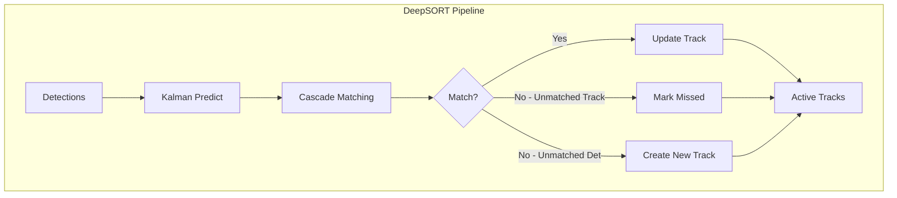
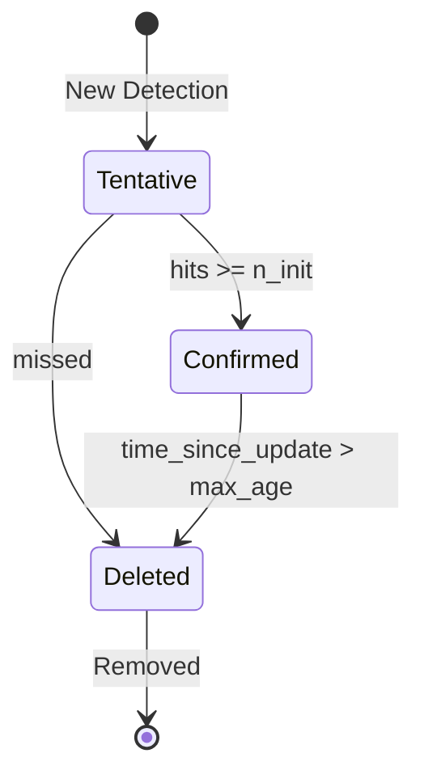
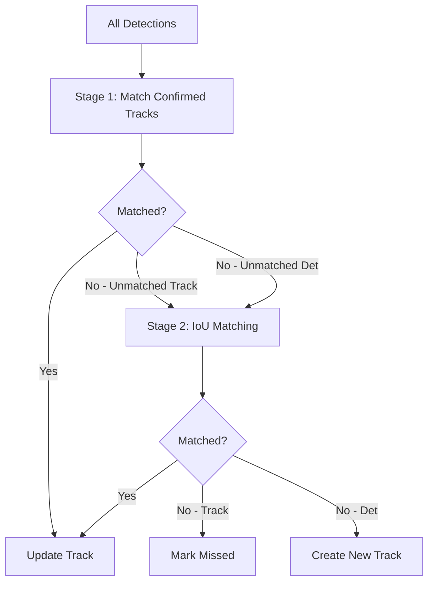
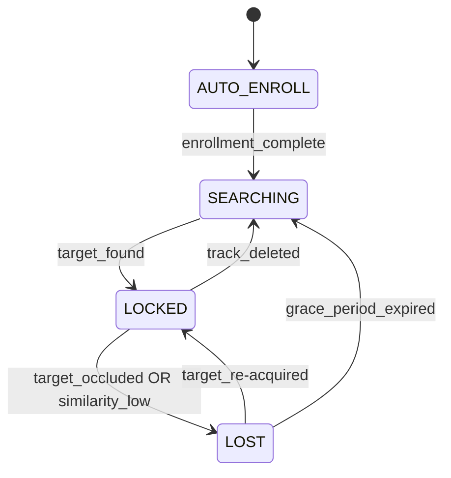

# Phân Tích Chi Tiết Thuật Toán Person Detector với DeepSORT

> **Tệp phân tích**: `person_detector.py` và module `tracking/`  
> **Ngày**: Tháng 12, 2025  

---

## 1. Tổng Quan Hệ Thống

### 1.1 Mục Đích
Hệ thống `PersonDetector` được thiết kế để **theo dõi đơn mục tiêu (Single-Target Tracking)** trên robot di động sử dụng camera RGB-D (Intel RealSense D455). Tối ưu cho **Orange Pi 5 Plus (CPU-only)**.

### 1.2 Kiến Trúc Tổng Thể



### 1.3 Các Module Chính

| Module | File | Chức Năng |
|--------|------|-----------|
| **PersonDetector** | `person_detector.py` | ROS2 Node chính, State Machine, điều khiển |
| **DeepSORTTracker** | `tracking/tracker.py` | Quản lý tracks, cascade matching |
| **KalmanFilter** | `tracking/kalman_filter.py` | Dự đoán vị trí, làm mượt trajectory |
| **Track** | `tracking/track.py` | Đại diện cho 1 object được track |
| **NN Matching** | `tracking/nn_matching.py` | Tính cost matrix, Hungarian algorithm |

---

## 2. Luồng Xử Lý Chính (Pipeline)

### 2.1 Sơ Đồ Luồng Dữ Liệu



### 2.2 Pseudo-code Tổng Quan

```python
def on_image(frame):
    # 1. Resize frame về 640x480
    frame = resize(frame, 640, 480)
    
    # 2. Phát hiện người với MobileNet-SSD
    boxes, scores = detect_persons(frame)
    
    # 3. Trích xuất đặc trưng cho mỗi detection
    features = []
    for box in boxes:
        feat = enhanced_body_feature(frame, box, depth_frame)
        features.append(feat)
    
    # 4. Cập nhật DeepSORT tracker
    tracks = deepsort.update(boxes, features)
    
    # 5. State Machine xử lý
    if state == 'SEARCHING':
        find_target_by_reid(tracks)
    elif state == 'LOCKED':
        follow_target_track()
    elif state == 'LOST':
        try_re_acquire_target()
    
    # 6. Tính toán điều khiển
    twist = compute_cmd(target_box)
    publish(twist)
```

---

## 3. Chi Tiết Các Module

### 3.1 Person Detection (MobileNet-SSD)

#### 3.1.1 Mô Hình
- **Kiến trúc**: MobileNet-SSD (Caffe implementation)
- **Input**: 300×300 RGB image
- **Output**: Bounding boxes + confidence scores cho class "person" (class_id=15)

#### 3.1.2 Thuật Toán Phát Hiện

```python
def _ssd_detect(net, frame, conf_thresh=0.4):
    # 1. Tiền xử lý: resize về 300x300, normalize
    blob = cv2.dnn.blobFromImage(
        cv2.resize(frame, (300, 300)),
        scalefactor=0.007843,
        size=(300, 300),
        mean=127.5
    )
    
    # 2. Inference
    net.setInput(blob)
    detections = net.forward()
    
    # 3. Lọc kết quả
    boxes, scores = [], []
    for detection in detections:
        if class_id == 15 and confidence > conf_thresh:  # person
            box = scale_to_original_size(detection)
            boxes.append(box)
            scores.append(confidence)
    
    return boxes, scores
```

#### 3.1.3 Tối Ưu CPU
- **Giảm độ phân giải**: Frame được resize về 640×480 trước khi xử lý
- **Frame skipping**: Có thể bỏ qua frames để giảm tải CPU
- **Ngưỡng confidence**: `0.4` để lọc các detection nhiễu

---

### 3.2 Feature Extraction (Trích Xuất Đặc Trưng)

#### 3.2.1 Enhanced Body Feature

Đặc trưng kết hợp **3 loại thông tin** để tăng độ robust:



#### 3.2.2 Chi Tiết Từng Đặc Trưng

##### a) Shape Features (MobileNetV2 Embedding)
```python
def body_arr_preserve_aspect_ratio(frame, box, target_size=(224, 224)):
    """Resize ROI giữ nguyên tỷ lệ, thêm padding."""
    # 1. Crop ROI từ bounding box
    roi = frame[y1:y2, x1:x2]
    
    # 2. Tính scale để fit vào 224x224
    scale = min(target_w / w, target_h / h)
    
    # 3. Resize
    resized_roi = cv2.resize(roi, (new_w, new_h))
    
    # 4. Thêm padding (màu xám 114)
    padded = np.full((224, 224, 3), 114, dtype=np.uint8)
    padded[y_offset:y_offset+new_h, x_offset:x_offset+new_w] = resized_roi
    
    return padded

# MobileNetV2 preprocessing (Keras style)
def mb2_preprocess_keras_style(x_uint8):
    x = x_uint8.astype(np.float32)
    x = x / 127.5 - 1.0  # Normalize to [-1, 1]
    return x

# Inference với ONNX Runtime
emb = ort_session.run(None, {inp_name: arr})[0]  # → 1280-dim vector
emb /= np.linalg.norm(emb)  # L2 normalize
```

**Kích thước vector**: **1280 dimensions**

##### b) Color Features (HSV Histogram)
```python
def hsv_histogram(roi_bgr, bins=16, v_weight=0.5, normalize_brightness=True):
    """Trích xuất histogram màu trong không gian HSV."""
    hsv = cv2.cvtColor(roi_bgr, cv2.COLOR_BGR2HSV)
    
    # Normalize brightness (chống thay đổi ánh sáng)
    if normalize_brightness:
        v_channel = hsv[:,:,2].astype(np.float32)
        v_mean = v_channel.mean()
        if v_mean > 10:
            v_channel = np.clip(v_channel * (128.0 / v_mean), 0, 255)
            hsv[:,:,2] = v_channel.astype(np.uint8)
    
    # Tính histogram cho H, S, V
    histH = cv2.calcHist([hsv], [0], None, [16], [0, 180])  # 16 bins
    histS = cv2.calcHist([hsv], [1], None, [16], [0, 256])  # 16 bins
    histV = cv2.calcHist([hsv], [2], None, [16], [0, 256])  # 16 bins
    
    # Giảm weight của V channel (ít quan trọng hơn)
    histV *= v_weight  # v_weight = 0.5
    
    # Concatenate và normalize
    h = np.concatenate([histH, histS, histV])  # 48 dims
    h /= np.linalg.norm(h)
    
    return h
```

**Kích thước vector**: **48 dimensions** (16×3 bins)

##### c) Depth Features
```python
def extract_depth_feature(box, depth_img, target_size=(16, 16)):
    """Trích xuất đặc trưng từ depth map."""
    # 1. Crop depth ROI
    roi = depth_img[y1:y2, x1:x2]
    
    # 2. Resize về 16×16
    roi_resized = cv2.resize(roi, (16, 16))
    
    # 3. Normalize: gần → 1.0, xa → 0.0
    # Giả định target trong khoảng 0.5m - 5m
    roi_normalized = np.clip((5000 - roi_resized) / 4500.0, 0.0, 1.0)
    
    # 4. Flatten
    depth_feat = roi_normalized.flatten()  # 256 dims
    
    return depth_feat
```

**Kích thước vector**: **256 dimensions** (16×16)

##### d) Kết Hợp Đặc Trưng
```python
def enhanced_body_feature(frame, box, depth_img, ort_sess, color_weight=0.3):
    """Kết hợp 3 loại đặc trưng với trọng số."""
    
    # 1. Shape embedding (MobileNetV2)
    emb = get_mobilenet_embedding(frame, box)  # 1280 dims
    
    # 2. Color histogram
    col = hsv_histogram(roi, bins=16)  # 48 dims
    
    # 3. Depth feature
    depth_feat = extract_depth_feature(box, depth_img)  # 256 dims
    
    # 4. Áp dụng trọng số
    emb_weighted = emb * (1.0 - color_weight)     # × 0.7
    col_weighted = col * color_weight              # × 0.3
    depth_weighted = depth_feat * 0.1              # × 0.1 (trọng số nhỏ)
    
    # 5. Concatenate và normalize
    feat = np.concatenate([emb_weighted, col_weighted, depth_weighted])
    feat /= np.linalg.norm(feat)
    
    return feat  # Tổng: 1280 + 48 + 256 = 1584 dimensions
```

**Tổng kích thước feature vector**: **1584 dimensions**

#### 3.2.3 Lý Do Thiết Kế

| Đặc Trưng | Ưu Điểm | Nhược Điểm |
|-----------|---------|------------|
| **Shape (MobileNet)** | Robust với thay đổi góc nhìn, ánh sáng | Cần nhiều computation |
| **Color (HSV)** | Nhanh, phân biệt quần áo khác nhau | Nhạy với ánh sáng, bóng đổ |
| **Depth** | Phân biệt khoảng cách, phát hiện occlusion | Chỉ có với camera RGB-D |

---

### 3.3 DeepSORT Tracker

#### 3.3.1 Tổng Quan DeepSORT

DeepSORT là phần mở rộng của SORT (Simple Online and Realtime Tracking) với thêm **appearance features** để cải thiện data association.



#### 3.3.2 Kalman Filter

##### State Space
```
State vector: [x, y, a, h, vx, vy, va, vh]

Trong đó:
- (x, y): Tâm bounding box
- a: Aspect ratio (width/height)
- h: Height
- vx, vy, va, vh: Vận tốc tương ứng
```

##### Motion Model (Constant Velocity)
```python
class KalmanFilter:
    def __init__(self):
        # Motion matrix F (8×8)
        # [ I  dt*I ]
        # [ 0   I   ]
        self._motion_mat = np.eye(8)
        for i in range(4):
            self._motion_mat[i, 4+i] = 1.0  # dt = 1 frame
        
        # Observation matrix H (4×8)
        # Chỉ observe [x, y, a, h], không observe velocity
        self._update_mat = np.eye(4, 8)
```

##### Các Phương Thức Chính

**1. Initiate (Khởi tạo track mới)**
```python
def initiate(self, measurement):
    """
    Tạo track mới từ detection.
    
    Input: measurement = [x, y, a, h]
    Output: mean (8-dim), covariance (8×8)
    """
    mean_pos = measurement
    mean_vel = np.zeros(4)  # Velocity khởi đầu = 0
    mean = np.r_[mean_pos, mean_vel]
    
    # Covariance ban đầu (uncertainty lớn cho velocity)
    std = [
        2 * std_weight_pos * h,   # x
        2 * std_weight_pos * h,   # y
        1e-2,                      # a
        2 * std_weight_pos * h,   # h
        10 * std_weight_vel * h,  # vx
        10 * std_weight_vel * h,  # vy
        1e-5,                      # va
        10 * std_weight_vel * h   # vh
    ]
    covariance = np.diag(np.square(std))
    
    return mean, covariance
```

**2. Predict (Dự đoán)**
```python
def predict(self, mean, covariance):
    """
    Dự đoán state tại time step tiếp theo.
    
    Công thức:
    x' = F × x
    P' = F × P × F^T + Q
    """
    # Process noise Q (phụ thuộc vào height)
    motion_cov = compute_motion_noise(mean[3])  # h
    
    mean = np.dot(self._motion_mat, mean)
    covariance = np.linalg.multi_dot([
        self._motion_mat, covariance, self._motion_mat.T
    ]) + motion_cov
    
    return mean, covariance
```

**3. Update (Cập nhật)**
```python
def update(self, mean, covariance, measurement):
    """
    Kalman filter correction step.
    
    Công thức:
    y = z - H × x'          (Innovation)
    S = H × P' × H^T + R    (Innovation covariance)
    K = P' × H^T × S^(-1)   (Kalman gain)
    x = x' + K × y          (Updated state)
    P = P' - K × S × K^T    (Updated covariance)
    """
    # Project to measurement space
    projected_mean, projected_cov = self.project(mean, covariance)
    
    # Kalman gain (sử dụng Cholesky decomposition)
    chol_factor, _ = scipy.linalg.cho_factor(projected_cov)
    kalman_gain = scipy.linalg.cho_solve(
        (chol_factor, True),
        np.dot(covariance, self._update_mat.T).T
    ).T
    
    # Update
    innovation = measurement - projected_mean
    new_mean = mean + np.dot(innovation, kalman_gain.T)
    new_covariance = covariance - np.linalg.multi_dot([
        kalman_gain, projected_cov, kalman_gain.T
    ])
    
    return new_mean, new_covariance
```

**4. Gating Distance (Mahalanobis Distance)**
```python
def gating_distance(self, mean, covariance, measurements):
    """
    Tính khoảng cách Mahalanobis để lọc associations không hợp lý.
    
    d² = (z - Hx)^T × S^(-1) × (z - Hx)
    
    Nếu d² > chi2_threshold (9.4877 at 95%), cặp này bị loại.
    """
    mean, covariance = self.project(mean, covariance)
    
    cholesky = np.linalg.cholesky(covariance)
    d = measurements - mean
    z = scipy.linalg.solve_triangular(cholesky, d.T, lower=True)
    squared_maha = np.sum(z * z, axis=0)
    
    return squared_maha
```

#### 3.3.3 Track Class

##### Track State
```python
class TrackState(IntEnum):
    Tentative = 1   # Chưa được xác nhận (đang chờ n_init frames)
    Confirmed = 2   # Đã xác nhận
    Deleted = 3     # Đánh dấu để xóa
```

##### Track Lifecycle


##### Track Attributes
```python
class Track:
    def __init__(self, mean, covariance, track_id, n_init, max_age, feature):
        self.mean = mean           # State vector (8-dim)
        self.covariance = covariance  # Covariance matrix (8×8)
        self.track_id = track_id   # Unique ID
        self.hits = 1              # Số lần được matched
        self.age = 1               # Số frames tồn tại
        self.time_since_update = 0 # Số frames từ lần update cuối
        self.state = TrackState.Tentative
        self.features = [feature]  # Lịch sử features (max 30)
        
        self._n_init = n_init      # 3 (cần 3 frames liên tiếp để confirm)
        self._max_age = max_age    # 30 (mất 30 frames thì xóa)
```

##### Feature History
```python
def update(self, kf, detection, feature):
    # Kalman update
    self.mean, self.covariance = kf.update(...)
    
    # Lưu feature mới
    if feature is not None:
        self.features.append(feature)
        # Chỉ giữ 30 features gần nhất
        if len(self.features) > 30:
            self.features = self.features[-30:]
    
    self.hits += 1
    self.time_since_update = 0
    
    # Transition to Confirmed
    if self.state == Tentative and self.hits >= self._n_init:
        self.state = TrackState.Confirmed

def get_feature(self):
    """Lấy feature trung bình từ lịch sử."""
    if len(self.features) == 0:
        return None
    return np.mean(self.features, axis=0)
```

#### 3.3.4 Cascade Matching

##### Tổng Quan


##### Stage 1: Appearance + Motion Matching
```python
def _match_confirmed(self, detections, features, track_indices):
    """Match confirmed tracks dùng appearance + IoU cost."""
    
    # 1. Appearance cost (cosine distance)
    appearance_cost = appearance_cost_matrix(tracks, features)
    # cost[i,j] = 1 - cosine_similarity(track_i.feature, det_j.feature)
    
    # 2. IoU cost (proxy for motion)
    iou_cost = iou_cost_matrix(tracks, detections)
    # cost[i,j] = 1 - IoU(track_i.bbox, det_j.bbox)
    
    # 3. Combined cost
    # lambda_weight = 0.3 (default)
    cost = lambda_weight * iou_cost + (1 - lambda_weight) * appearance_cost
    
    # 4. Kalman gating (loại các cặp quá xa về mặt thống kê)
    cost = gate_cost_matrix(kf, cost, tracks, detections)
    # Nếu Mahalanobis distance > 9.4877, set cost = INFTY
    
    # 5. Appearance threshold
    cost[appearance_cost > max_cosine_distance] = INFTY
    # max_cosine_distance = 0.4 (default)
    
    # 6. Hungarian algorithm
    matches, unmatched_tracks, unmatched_dets = hungarian(cost)
    
    return matches, unmatched_tracks, unmatched_dets
```

##### Stage 2: IoU-only Matching
```python
def _match_iou(self, detections, track_indices, detection_indices):
    """Match tentative tracks và remaining confirmed tracks chỉ bằng IoU."""
    
    iou_cost = iou_cost_matrix(tracks, detections)
    
    # IoU threshold: cost < 0.7 → IoU > 0.3
    matches, unmatched_tracks, unmatched_dets = hungarian(
        iou_cost, max_distance=0.7
    )
    
    return matches, unmatched_tracks, unmatched_dets
```

##### Hungarian Algorithm
```python
def min_cost_matching(cost_matrix, max_distance, track_indices, detection_indices):
    """
    Giải bài toán gán tối ưu (Linear Sum Assignment).
    
    Sử dụng scipy.optimize.linear_sum_assignment (Hungarian algorithm).
    Complexity: O(n³) với n = max(num_tracks, num_detections)
    """
    row_indices, col_indices = linear_sum_assignment(cost_matrix)
    
    matches = []
    unmatched_tracks = []
    unmatched_detections = list(detection_indices)
    
    for row, col in zip(row_indices, col_indices):
        track_idx = track_indices[row]
        detection_idx = detection_indices[col]
        
        if cost_matrix[row, col] > max_distance:
            unmatched_tracks.append(track_idx)
        else:
            matches.append((track_idx, detection_idx))
            unmatched_detections.remove(detection_idx)
    
    return matches, unmatched_tracks, unmatched_detections
```

#### 3.3.5 Cost Metrics Chi Tiết

##### Cosine Distance (Appearance)
```python
def _nn_cosine_distance(track_features, detection_feature):
    """
    Khoảng cách cosine nhỏ nhất giữa detection và lịch sử features của track.
    
    Sử dụng toàn bộ feature history (max 30 features) để so sánh.
    """
    detection_feature /= np.linalg.norm(detection_feature)
    
    min_distance = INFTY
    for feat in track_features:
        feat /= np.linalg.norm(feat)
        dist = 1.0 - np.dot(feat, detection_feature)
        min_distance = min(min_distance, dist)
    
    return min_distance  # Range: [0, 2], 0 = giống nhất
```

##### IoU Cost
```python
def iou_cost(tracks, detections, track_indices, detection_indices):
    """
    Cost matrix dựa trên IoU.
    
    cost[i,j] = 1 - IoU(track_i.predicted_bbox, detection_j)
    """
    for track_idx, det_idx in product(track_indices, detection_indices):
        track_bbox = tracks[track_idx].to_tlwh()  # Predicted bbox
        det_bbox = convert_tlbr_to_tlwh(detections[det_idx])
        
        iou_score = compute_iou(track_bbox, det_bbox)
        cost[row, col] = 1.0 - iou_score  # Range: [0, 1]
```

---

### 3.4 State Machine

#### 3.4.1 Các Trạng Thái



| State | Mô Tả | Hành Động |
|-------|-------|-----------|
| **AUTO-ENROLL** | Thu thập mẫu target | Không điều khiển robot |
| **SEARCHING** | Tìm kiếm target | Xoay 360° (tùy chọn) |
| **LOCKED** | Đang theo dõi target | Di chuyển theo target |
| **LOST** | Tạm mất target | Dùng Kalman predict, chờ re-acquire |

#### 3.4.2 AUTO-ENROLL Phase

```python
def auto_enroll_step(self, frame, pboxes):
    """Thu thập mẫu feature để tạo target model."""
    
    # Tìm detection lớn nhất (gần camera nhất)
    j = np.argmax([area(box) for box in pboxes])
    target_box = pboxes[j]
    
    # Trích xuất feature
    feat = enhanced_body_feature(frame, target_box, depth_img)
    
    # Cập nhật centroid (EMA)
    if self.body_centroid is None:
        self.body_centroid = feat.copy()
    else:
        # Exponential Moving Average: 90% old + 10% new
        self.body_centroid = 0.9 * self.body_centroid + 0.1 * feat
        self.body_centroid /= np.linalg.norm(self.body_centroid)
    
    # Điều kiện hoàn thành
    if time_elapsed > 30s or num_samples >= 100:
        self.target_feature = self.body_centroid.copy()
        self.original_target_feature = self.body_centroid.copy()  # ANCHOR
        self.state = 'SEARCHING'
```

**Tham số**:
- `auto_timeout_sec`: 30 giây
- `auto_body_target`: 100 samples
- `auto_body_min`: 30 samples (minimum)

#### 3.4.3 SEARCHING State

```python
def state_searching(self, confirmed_tracks):
    """Tìm track có similarity cao nhất với target_feature."""
    
    best_track = None
    best_score = -1.0
    
    for track in confirmed_tracks:
        track_feature = track.get_feature()  # Mean of feature history
        score = np.dot(track_feature, self.target_feature)  # Cosine similarity
        
        if score > best_score:
            best_score = score
            best_track = track
    
    # Ngưỡng chấp nhận: 0.75
    if best_score > self.accept_threshold:
        self.state = 'LOCKED'
        self.current_track_id = best_track.track_id
        self.target_box = best_track.to_tlbr()
        logger.info(f"Target LOCKED with track_id={self.current_track_id}")
```

#### 3.4.4 LOCKED State

```python
def state_locked(self, confirmed_tracks, depth_frame):
    """Theo dõi target track đã lock."""
    
    # 1. Kiểm tra occlusion
    if is_target_occluded(self.target_box, depth_frame, self.last_known_depth):
        self.state = 'LOST'
        return
    
    # 2. Tìm target track
    target_track = deepsort.get_track_by_id(self.current_track_id)
    
    if target_track is not None and not target_track.is_deleted():
        self.target_box = target_track.to_tlbr()
        
        # Tính similarity
        track_feature = target_track.get_feature()
        similarity = np.dot(track_feature, self.target_feature)
        
        # Adaptive model update
        if reject_threshold < similarity < adaptive_update_threshold:
            if time_since_last_update > 1.0:
                adaptive_model_update(self.target_box, frame, depth_frame)
        
        # Nếu similarity quá thấp → mất target
        if similarity < reject_threshold:  # 0.6
            self.state = 'LOST'
    else:
        # Track không tồn tại, thử ReID
        best_track = find_best_track_by_reid(confirmed_tracks)
        if best_track is not None:
            self.current_track_id = best_track.track_id
        else:
            self.state = 'LOST'
```

#### 3.4.5 LOST State

```python
def state_lost(self, confirmed_tracks, depth_frame):
    """Xử lý khi mất target tạm thời."""
    
    # Kalman filter vẫn predict vị trí
    target_track = deepsort.get_track_by_id(self.current_track_id)
    
    if target_track is not None:
        self.target_box = target_track.to_tlbr()  # Predicted position
        
        # Nếu track được matched với detection mới
        if target_track.time_since_update == 0:
            score = np.dot(target_track.get_feature(), self.target_feature)
            if score > accept_threshold:
                self.state = 'LOCKED'
                logger.info("Target re-acquired!")
    else:
        # Tìm bằng ReID
        best_track = find_best_track_by_reid(confirmed_tracks)
        if best_track is not None:
            self.state = 'LOCKED'
            self.current_track_id = best_track.track_id
    
    # Grace period
    if time_since_lost > grace_period_sec:  # 2 giây
        self.state = 'SEARCHING'
        self.target_box = None
        self.current_track_id = None
```

#### 3.4.6 Occlusion Detection

```python
def is_target_occluded(self, target_box, depth_img, last_known_depth):
    """
    Phát hiện target bị che khuất bằng depth.
    
    Nếu depth hiện tại < depth trước đó - threshold,
    có nghĩa là có vật thể gần hơn che trước target.
    """
    current_depth = get_median_depth_at_box(target_box, depth_img)
    
    if current_depth is None:
        return False
    
    threshold = 0.5  # meters
    
    # Nếu current_depth gần hơn đáng kể → bị che
    if current_depth < (last_known_depth - threshold):
        return True
    
    return False
```

---

### 3.5 Adaptive Model Update

#### 3.5.1 Vấn Đề: Model Drift
Khi theo dõi trong thời gian dài, ngoại hình target có thể thay đổi (ánh sáng, góc nhìn). Nếu không cập nhật model, similarity sẽ giảm dần.

#### 3.5.2 Giải Pháp: Anchor-Based Update

```python
def adaptive_model_update(self, box, frame, depth_frame):
    """Cập nhật model thông minh, giữ anchor."""
    
    # 1. Trích xuất feature mới
    candidate_feat = enhanced_body_feature(frame, box, depth_frame)
    
    # 2. Kiểm tra quality
    similarity = np.dot(candidate_feat, self.target_feature)
    
    # Từ chối nếu quá khác (có thể là người khác)
    if similarity < reject_threshold:  # 0.6
        logger.warn("Update rejected: low similarity")
        return
    
    # Bỏ qua nếu quá giống (không cần update)
    if similarity > 0.99:
        logger.info("Update skipped: sample too similar")
        return
    
    # 3. Cập nhật với ANCHOR
    update_target_model(candidate_feat)

def update_target_model(self, new_feature):
    """
    Công thức Anchor-Based Update:
    
    target = 0.6 × ORIGINAL + 0.3 × current + 0.1 × new
    
    Đảm bảo:
    - 60% mẫu gốc → Không bao giờ drift quá xa
    - Chỉ có tối đa 40% thay đổi
    """
    anchor_weight = 0.6
    current_weight = 0.3
    new_weight = 0.1
    
    self.target_feature = (
        anchor_weight * self.original_target_feature +  # ANCHOR - không đổi
        current_weight * self.target_feature +
        new_weight * new_feature
    )
    
    self.target_feature /= np.linalg.norm(self.target_feature)
```

#### 3.5.3 Visualization

```
Enrollment:
  original_feature ──────────────────────── (saved as anchor)
  target_feature = original_feature

After Update 1:
  target = 0.6 × original + 0.3 × target + 0.1 × new
  
After Update N:
  target = 0.6 × original + 0.3 × (updated_target) + 0.1 × new
         ↓
  Luôn giữ 60% original, tránh drift hoàn toàn
```

---

### 3.6 Robot Control

#### 3.6.1 Heading Control (Xoay robot)

```python
def compute_heading_control(self, frame_w, target_box):
    """Điều khiển robot xoay để căn giữa target."""
    
    # Tính offset từ tâm frame
    cx, _ = center_of(target_box)
    err_px = cx - frame_w / 2  # > 0 nếu target ở bên phải
    
    # Deadband: không xoay nếu offset nhỏ
    dead = 40  # pixels
    if abs(err_px) <= dead:
        self._is_centered = True
        err_eff = 0
    else:
        err_eff = np.sign(err_px) * (abs(err_px) - dead)
    
    # P controller
    kx = 0.00025  # Gain
    wz = -kx * err_eff  # Ngược dấu: target phải → xoay phải (wz < 0)
    
    # Clamp
    wz = clamp(wz, -0.25, 0.25)  # rad/s
    
    return wz
```

#### 3.6.2 Forward Control (Tiến/lùi)

```python
def compute_forward_control(self, target_box, depth_img):
    """Điều khiển robot tiến/lùi để giữ khoảng cách."""
    
    # Lấy depth (median + EMA filter)
    depth_raw = get_median_depth_at_box(target_box, depth_img)
    
    if self.depth_ema is None:
        self.depth_ema = depth_raw
    else:
        # EMA smoothing (alpha = 0.3)
        self.depth_ema = 0.3 * depth_raw + 0.7 * self.depth_ema
    
    depth_m = self.depth_ema
    
    # P controller
    kd = 0.6
    d_des = 2.0  # Khoảng cách mong muốn (m)
    err_d = depth_m - d_des
    
    # Chỉ tiến nếu đã căn giữa (center_first = True)
    if self._is_centered and err_d > 0:
        vx = clamp(kd * err_d, 0, 0.3)  # m/s
    else:
        vx = 0
    
    return vx
```

#### 3.6.3 Depth Filtering (EMA)

```python
# Tránh vx nhảy do depth noise

raw:    1.8   2.2   1.9   2.5   2.0   ...
EMA:    1.8   1.92  1.91  2.09  2.06  ... (smoother)

# Công thức EMA:
ema(t) = alpha * raw(t) + (1 - alpha) * ema(t-1)
# alpha = 0.3 → reaction nhanh vừa phải
```

---

## 4. Các Tham Số Quan Trọng

### 4.1 Detection
| Tham số | Giá trị | Mô tả |
|---------|---------|-------|
| `person_conf` | 0.35 | Ngưỡng confidence cho detection |
| `image_width` | 640 | Độ phân giải xử lý |
| `image_height` | 480 | Độ phân giải xử lý |

### 4.2 ReID / Matching
| Tham số | Giá trị | Mô tả |
|---------|---------|-------|
| `accept_threshold` | 0.75 | Ngưỡng để chấp nhận là target |
| `reject_threshold` | 0.6 | Ngưỡng để từ chối khi đã lock |
| `max_cosine_distance` | 0.4 | Ngưỡng appearance cost trong DeepSORT |
| `iou_threshold` | 0.4 | Ngưỡng IoU cho matching |
| `body_color_weight` | 0.22 | Trọng số color features |

### 4.3 DeepSORT
| Tham số | Giá trị | Mô tả |
|---------|---------|-------|
| `max_age` | 30 | Số frames trước khi xóa track |
| `n_init` | 3 | Số frames cần để confirm track |
| `lambda_weight` | 0.3 | Trọng số IoU cost (vs appearance) |

### 4.4 Control
| Tham số | Giá trị | Mô tả |
|---------|---------|-------|
| `target_distance_m` | 2.0 | Khoảng cách mong muốn (m) |
| `kd_distance` | 0.6 | Gain điều khiển vx |
| `kx_center` | 0.00025 | Gain điều khiển wz |
| `center_deadband_px` | 40 | Vùng chết căn giữa (pixels) |
| `v_forward_max` | 0.3 | Vận tốc tiến tối đa (m/s) |
| `wz_max` | 0.25 | Vận tốc xoay tối đa (rad/s) |

### 4.5 Occlusion & Lost
| Tham số | Giá trị | Mô tả |
|---------|---------|-------|
| `occlusion_threshold` | 0.5 | Ngưỡng depth để phát hiện che khuất (m) |
| `grace_period_sec` | 2.0 | Thời gian chờ trong LOST state |

---

## 5. Tổng Kết

### 5.1 Ưu Điểm

1. **Multi-modal Features**: Kết hợp shape + color + depth cho robust tracking
2. **Anchor-Based Update**: Tránh model drift khi track lâu
3. **Occlusion Handling**: Dùng depth để phát hiện che khuất
4. **Kalman Prediction**: Dự đoán vị trí khi mất detection tạm thời
5. **CPU Optimized**: Thiết kế cho Orange Pi 5 Plus

### 5.2 Hạn Chế

1. **Single Target**: Chỉ track 1 người
2. **CPU Bound**: MobileNet inference chậm hơn GPU
3. **Fixed Camera**: Thiết kế cho camera gắn cố định trên robot

### 5.3 Potential Improvements

1. Thêm **appearance normalization** khi ánh sáng thay đổi mạnh
2. Sử dụng **temporal features** (optical flow)
3. Implement **track confidence scoring** để lọc false positives
4. Thêm **multi-person handling** cho môi trường đông đúc
