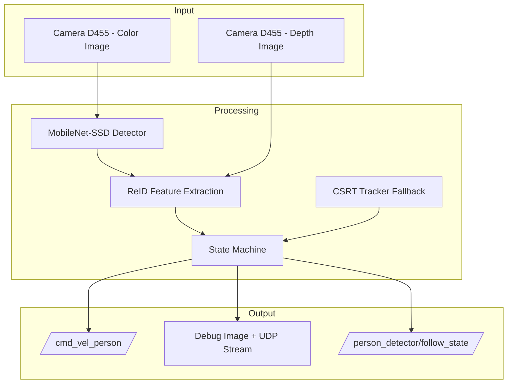
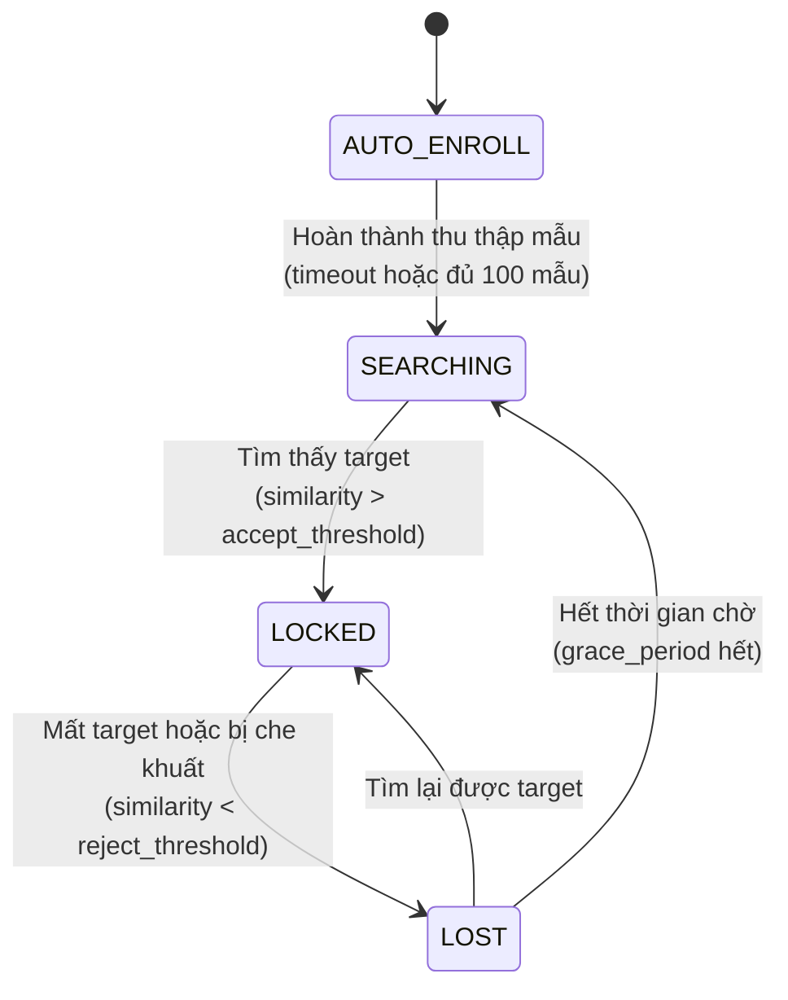
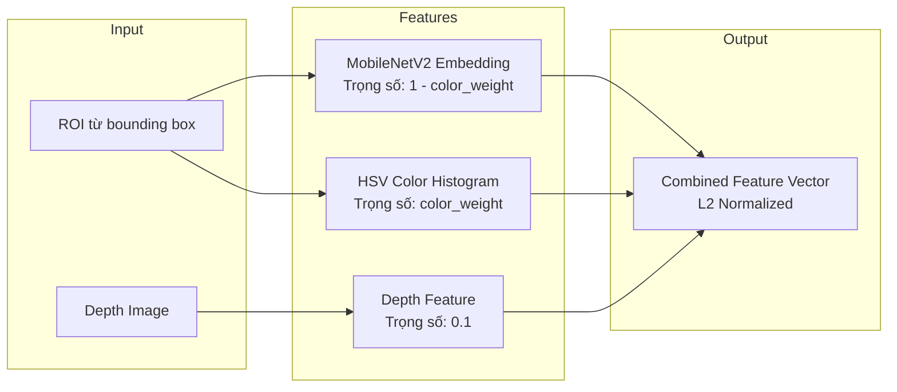
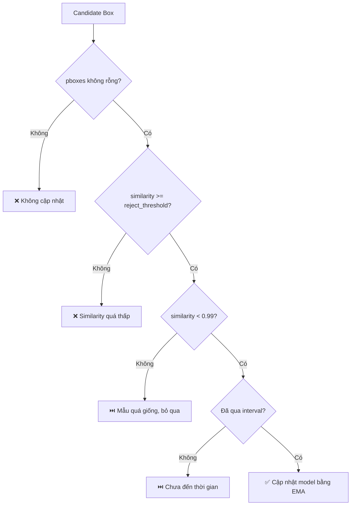
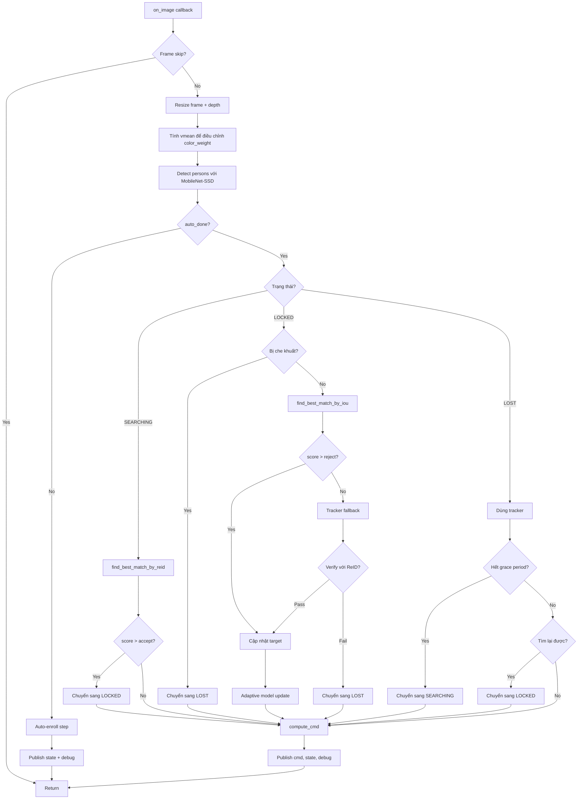

# Phân Tích Thuật Toán - Person Detector

> **File**: `person_detector_new_16_12.py`  
> **Mục đích**: Theo dõi một mục tiêu (người) duy nhất sử dụng camera Intel RealSense D455 và điều khiển robot mecanum.

---

## 1. Tổng Quan Hệ Thống

### 1.1 Kiến Trúc Tổng Quát



### 1.2 Các Thành Phần Chính

| Thành phần | Mô tả |
|------------|-------|
| **MobileNet-SSD** | Phát hiện người trong frame (Caffe model) |
| **MobileNetV2 + GAP** | Trích xuất đặc trưng ReID (ONNX model) |
| **CSRT Tracker** | Theo dõi ngắn hạn khi mất target |
| **State Machine** | Điều khiển luồng xử lý theo 4 trạng thái |
| **Depth Processing** | Xử lý depth để điều khiển khoảng cách và phát hiện che khuất |

---

## 2. State Machine (Máy Trạng Thái)

### 2.1 Sơ Đồ Chuyển Trạng Thái



### 2.2 Chi Tiết Từng Trạng Thái

#### 🔵 AUTO-ENROLL (Tự động ghi danh)
- **Mục đích**: Thu thập đặc trưng của mục tiêu để tạo model ReID
- **Điều kiện kết thúc**:
  - Hết timeout (mặc định 30 giây), HOẶC
  - Thu thập đủ số mẫu (mặc định 100 mẫu)
- **Xử lý**:
  1. Phát hiện người trong frame
  2. Chọn người có bounding box lớn nhất
  3. Trích xuất đặc trưng và thêm vào `body_samples`
  4. Cập nhật `body_centroid` bằng EMA (Exponential Moving Average)

#### 🟡 SEARCHING (Tìm kiếm)
- **Mục đích**: Tìm lại target sau khi mất hoặc sau enrollment
- **Phương pháp**: So khớp ReID toàn bộ các detection
- **Điều kiện chuyển sang LOCKED**: `similarity > accept_threshold` (mặc định 0.75)

#### 🟢 LOCKED (Đã khóa mục tiêu)
- **Mục đích**: Theo dõi và điều khiển robot đi theo target
- **Xử lý**:
  1. Kiểm tra che khuất (occlusion) bằng depth
  2. Tìm best match bằng IoU + ReID
  3. Nếu không tìm thấy → dùng CSRT Tracker fallback
  4. Cập nhật adaptive model (nếu đủ điều kiện)
- **Điều kiện chuyển sang LOST**: `similarity < reject_threshold` (mặc định 0.6)

#### 🔴 LOST (Mất mục tiêu)
- **Mục đích**: Cố gắng tìm lại target trong thời gian ngắn
- **Xử lý**:
  1. Dùng tracker để dự đoán vị trí
  2. Kiểm tra ReID tại vị trí dự đoán
- **Điều kiện**:
  - Tìm lại được → chuyển sang LOCKED
  - Hết `grace_period_sec` (mặc định 2s) → chuyển sang SEARCHING

---

## 3. Thuật Toán Trích Xuất Đặc Trưng (ReID)

### 3.1 Tổng Quan

Đặc trưng của một người được tạo từ **3 nguồn**:



### 3.2 Chi Tiết Từng Thành Phần

#### A. MobileNetV2 Embedding
- **Input**: ROI resize về 224x224 (giữ tỷ lệ, padding)
- **Preprocessing**: `(x / 127.5) - 1.0` (Keras style)
- **Output**: Vector embedding được normalize

#### B. HSV Color Histogram
- **Các bước**:
  1. Chuyển ROI sang không gian màu HSV
  2. Chuẩn hóa độ sáng (V channel) để chống chói
  3. Tính histogram 16 bins cho mỗi kênh H, S, V
  4. V channel có trọng số thấp hơn (`v_weight=0.6`)
  5. Concat và normalize
- **Mục đích**: Bổ sung đặc trưng màu sắc, ổn định hơn với thay đổi góc nhìn

#### C. Depth Feature
- **Input**: Vùng depth tương ứng với bounding box
- **Xử lý**:
  1. Resize về 16x16
  2. Chuẩn hóa: gần (< 5m) → 1.0, xa (> 5m) → 0.0
  3. Flatten thành vector
- **Mục đích**: Mô tả hình dạng 3D của người

### 3.3 Kết Hợp Đặc Trưng

```python
emb_weighted = emb * (1.0 - color_weight)  # ~0.78
col_weighted = col * color_weight          # ~0.22
depth_weighted = depth_feat * 0.1

feat = concatenate([emb_weighted, col_weighted, depth_weighted])
feat = L2_normalize(feat)
```

---

## 4. Thuật Toán Matching (So Khớp)

### 4.1 Matching trong SEARCHING

```python
def find_best_match_by_reid(boxes, frame, depth_frame):
    for box in boxes:
        feat = enhanced_body_feature(box)
        score = dot_product(feat, target_feature)  # Cosine similarity
        if score > best_score:
            best_box, best_score = box, score
    return best_box, best_score
```

- Duyệt tất cả các detection
- Tính cosine similarity với `target_feature`
- Chọn detection có score cao nhất

### 4.2 Matching trong LOCKED

```python
def find_best_match_by_iou(boxes, target_box, frame, depth_frame):
    for box in boxes:
        iou_score = iou(box, target_box)
        if iou_score < iou_threshold:  # Bỏ qua nếu IoU thấp
            continue
        feat = enhanced_body_feature(box)
        score = dot_product(feat, target_feature)
        if score > best_score:
            best_box, best_score = box, score
    return best_box, best_score
```

- **Bước 1**: Lọc bằng IoU (mặc định > 0.4)
- **Bước 2**: So khớp ReID trong các candidates

### 4.3 Tracker Fallback

Khi detector không tìm thấy target:
1. Sử dụng CSRT Tracker để dự đoán vị trí
2. **Quan trọng**: Xác minh tracker bằng ReID
3. Nếu ReID score < reject_threshold → từ chối tracker (tránh track nhầm)

---

## 5. Adaptive Model Update (Cập Nhật Model Thích Ứng)

### 5.1 Mục Đích
- Cho phép model thích ứng với thay đổi (ánh sáng, góc nhìn, quần áo)
- Tránh model drift (cập nhật sai)

### 5.2 Điều Kiện Cập Nhật



### 5.3 Công Thức Cập Nhật

```python
alpha = 0.2  # Hệ số học
target_feature = (1.0 - alpha) * target_feature + alpha * new_feature
target_feature = L2_normalize(target_feature)
```

---

## 6. Điều Khiển Robot

### 6.1 Điều Khiển Góc Quay (Angular)

```python
err_px = center_x - frame_width/2
if abs(err_px) <= deadband:
    angular_z = 0  # Trong vùng chết, không quay
else:
    err_eff = sign(err_px) * (abs(err_px) - deadband)
    angular_z = clamp(-kx * err_eff, -wz_max, +wz_max)
```

| Tham số | Giá trị mặc định | Mô tả |
|---------|------------------|-------|
| `kx_center` | 0.00025 | Hệ số P cho điều khiển góc |
| `wz_max` | 0.25 rad/s | Tốc độ quay tối đa |
| `center_deadband_px` | 40 px | Vùng chết |

### 6.2 Điều Khiển Tiến/Lùi (Linear)

```python
depth_m = get_median_depth_at_box(target_box)
err_d = depth_m - target_distance
if is_centered and err_d > 0:
    linear_x = clamp(kd * err_d, 0, v_forward_max)
else:
    linear_x = 0
```

| Tham số | Giá trị mặc định | Mô tả |
|---------|------------------|-------|
| `target_distance_m` | 2 m | Khoảng cách mong muốn |
| `kd_distance` | 0.6 | Hệ số P cho điều khiển khoảng cách |
| `v_forward_max` | 0.3 m/s | Tốc độ tiến tối đa |
| `center_first` | True | Căn giữa trước rồi mới tiến |

---

## 7. Phát Hiện Che Khuất (Occlusion Detection)

### 7.1 Thuật Toán

```python
def is_target_occluded(target_box, depth_img, last_known_depth):
    current_depth = get_median_depth_at_box(target_box)
    threshold = 0.5  # meters
    
    if current_depth < (last_known_depth - threshold):
        return True  # Có vật thể gần hơn → bị che
    return False
```

### 7.2 Giải Thích
- So sánh depth hiện tại với depth đã biết trước đó
- Nếu depth **giảm đột ngột** (vật gần hơn) → có vật che khuất target
- Ngưỡng mặc định: 0.5m

---

## 8. Tối Ưu Cho CPU

### 8.1 Các Kỹ Thuật Đã Áp Dụng

| Kỹ thuật | Chi tiết |
|----------|----------|
| **Giảm độ phân giải** | 640x480 thay vì 1920x1080 |
| **Frame skipping** | Xử lý mỗi frame thứ N |
| **ROI-based detection** | Chỉ detect trong vùng mở rộng của target |
| **ONNX Runtime** | Tối ưu inference với các optimizations |

### 8.2 Cấu Hình ONNX

```python
sess_options.graph_optimization_level = ORT_ENABLE_ALL
sess_options.execution_mode = ORT_SEQUENTIAL
providers = ["CPUExecutionProvider"]
```

---

## 9. Các Ngưỡng Quan Trọng

| Tham số | Giá trị | Mô tả |
|---------|---------|-------|
| `accept_threshold` | 0.75 | Ngưỡng để chấp nhận là target (SEARCHING → LOCKED) |
| `reject_threshold` | 0.6 | Ngưỡng để từ chối (LOCKED → LOST) |
| `iou_threshold` | 0.4 | Ngưỡng IoU để xem xét candidate |
| `occlusion_threshold` | 0.5 m | Ngưỡng depth để phát hiện che khuất |
| `grace_period_sec` | 2.0 s | Thời gian chờ trước khi chuyển về SEARCHING |

---

## 10. ROS2 Topics

### 10.1 Subscribers

| Topic | Type | Mô tả |
|-------|------|-------|
| `/camera/d455/color/image_raw` | `sensor_msgs/Image` | Ảnh màu từ camera |
| `/camera/d455/depth/image_rect_raw` | `sensor_msgs/Image` | Ảnh depth |

### 10.2 Publishers

| Topic | Type | Mô tả |
|-------|------|-------|
| `/cmd_vel_person` | `geometry_msgs/Twist` | Lệnh điều khiển vận tốc |
| `/person_detected` | `std_msgs/Bool` | Flag có detect được người không |
| `/person_detector/debug_image` | `sensor_msgs/Image` | Ảnh debug |
| `/person_detector/follow_state` | `std_msgs/String` | Trạng thái hiện tại |
| `/person_distance` | `std_msgs/Float32` | Khoảng cách đến target |
| `/person_centered` | `std_msgs/Bool` | Target có ở trung tâm không |

---

## 11. Luồng Xử Lý Chính



---

## 12. Tóm Tắt Các Điểm Mạnh

1. **State Machine rõ ràng**: 4 trạng thái với logic chuyển đổi minh bạch
2. **Multi-modal ReID**: Kết hợp appearance, color histogram, và depth
3. **Adaptive model update**: Cho phép model thích ứng nhưng có nhiều điều kiện chống drift
4. **Tracker fallback với verification**: Tránh track nhầm background
5. **Occlusion detection**: Phát hiện che khuất bằng depth
6. **CPU optimized**: Nhiều kỹ thuật tối ưu cho Orange Pi

## 13. Các Điểm Có Thể Cải Thiện

1. **Hungarian matching**: Có import nhưng chưa sử dụng
2. **Diversity check cho enrollment**: Nên loại bỏ các mẫu quá giống nhau
3. **Kalman filter**: Có thể thêm để smooth trajectory prediction
4. **Multi-scale detection**: Detect ở nhiều scale để cải thiện recall
