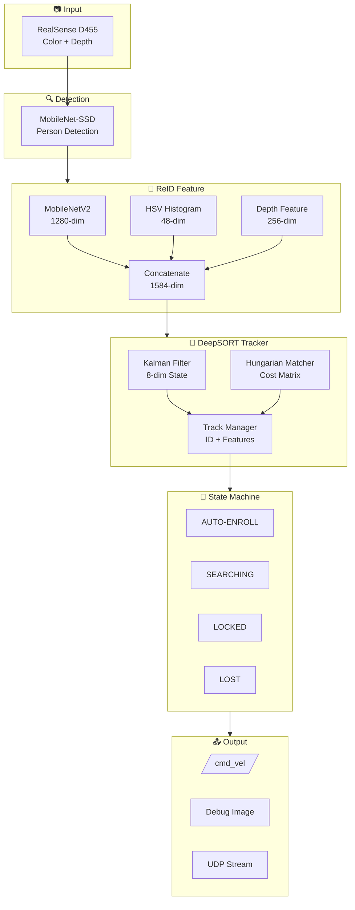
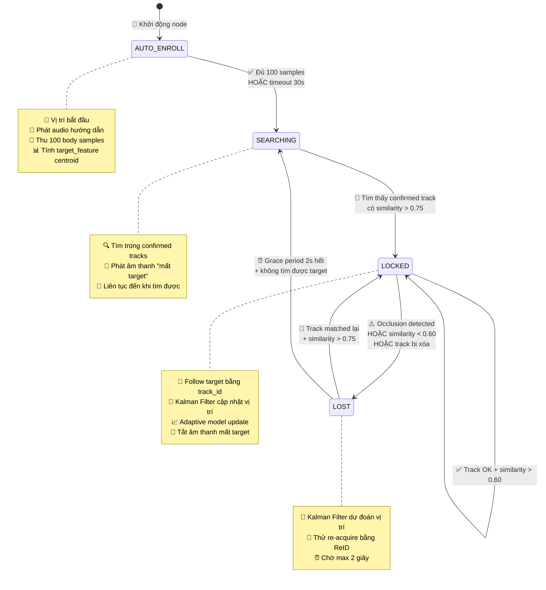
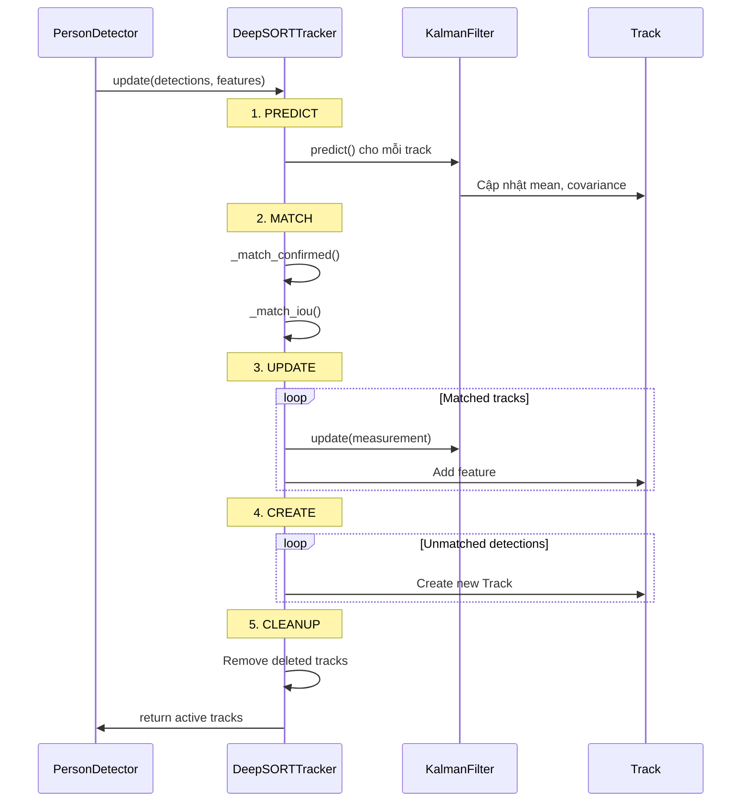
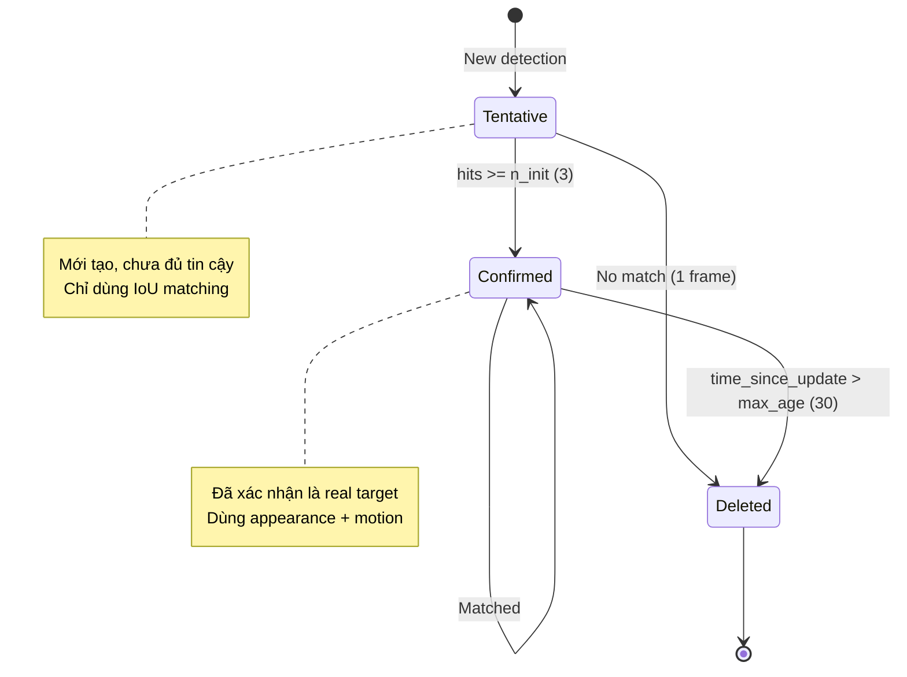
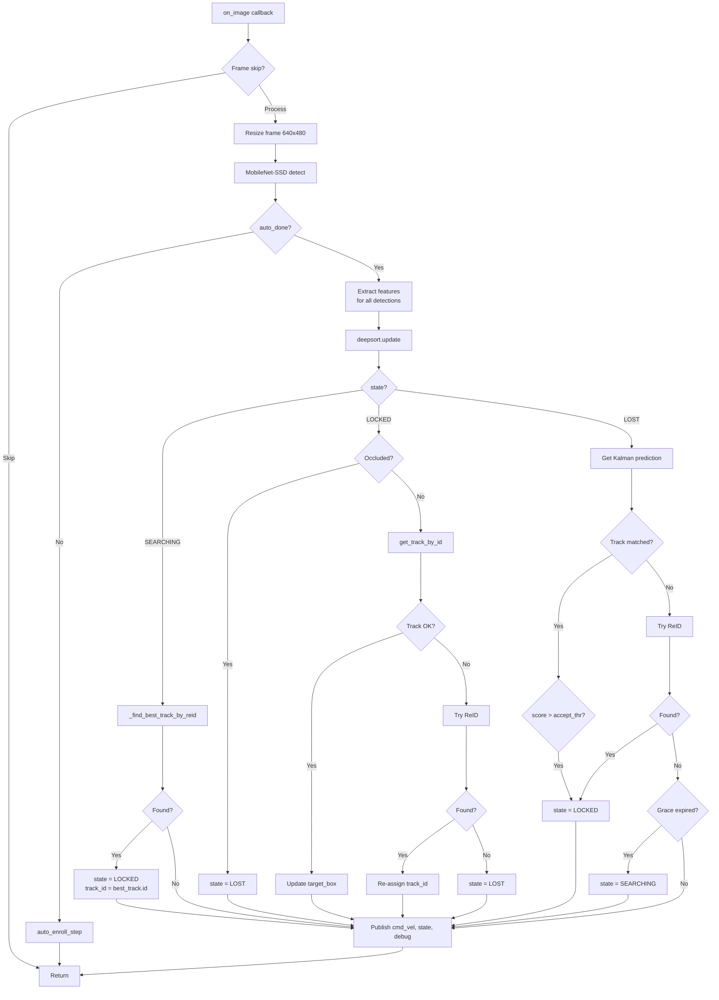

# 📚 Phân Tích Chi Tiết Thuật Toán DeepSORT trong Person Detector

> **Tác giả**: AI Engineer  
> **Ngày**: 17/12/2024  
> **File chính**: `person_detector.py` (895 dòng)  
> **Sub-package**: `tracking/` (4 files)

---

## 📖 Mục Lục

1. [Tổng Quan Kiến Trúc](#1-tổng-quan-kiến-trúc)
2. [State Machine (Máy Trạng Thái)](#2-state-machine-máy-trạng-thái)
3. [DeepSORT Tracker](#3-deepsort-tracker)
4. [Kalman Filter](#4-kalman-filter)
5. [Track Management](#5-track-management)
6. [Matching Algorithm](#6-matching-algorithm)
7. [Feature Extraction (ReID)](#7-feature-extraction-reid)
8. [Luồng Xử Lý Chi Tiết](#8-luồng-xử-lý-chi-tiết)
9. [Tham Số Cấu Hình](#9-tham-số-cấu-hình)

---

## 1. Tổng Quan Kiến Trúc

### 1.1 Sơ Đồ Kiến Trúc Tổng Thể



### 1.2 Các Thành Phần Chính

| Thành phần | File | Chức năng |
|------------|------|-----------|
| **PersonDetector** | `person_detector.py` | ROS2 Node chính, xử lý state machine |
| **DeepSORTTracker** | `tracking/tracker.py` | Điều phối tracking, matching, track lifecycle |
| **KalmanFilter** | `tracking/kalman_filter.py` | Dự đoán vị trí bằng motion model |
| **Track** | `tracking/track.py` | Lưu trạng thái và feature của mỗi target |
| **nn_matching** | `tracking/nn_matching.py` | Cost matrix và Hungarian matching |

---

## 2. State Machine (Máy Trạng Thái) - PHÂN TÍCH CHI TIẾT

### 2.1 Tổng Quan 4 Trạng Thái

| Trạng thái | Mục đích | Robot hành vi | Thời gian |
|------------|----------|---------------|-----------|
| **AUTO-ENROLL** | Thu thập đặc trưng target | Đứng yên | 30s hoặc 100 samples |
| **SEARCHING** | Tìm kiếm target | Có thể xoay | Không giới hạn |
| **LOCKED** | Đang follow target | Di chuyển theo | Liên tục |
| **LOST** | Tạm mất target | Đứng yên/chậm | Max 2s (grace period) |

### 2.2 Sơ Đồ Chuyển Trạng Thái Chi Tiết



---

### 2.3 Chi Tiết Từng Trạng Thái

---

#### 🟢 **AUTO-ENROLL** - Giai đoạn đăng ký target

**File**: `person_detector.py` dòng 413-445, 723-742

**Mục đích**: Thu thập đặc trưng ngoại hình của target để làm mẫu so sánh sau này.

**Điều kiện vào**:
- Node vừa khởi động (`self.auto_done = False`)

**Hoạt động trong trạng thái**:

```python
def auto_enroll_step(self, frame, pboxes):
    # 1. Chọn person box LỚN NHẤT trong frame
    #    (Giả định người đứng gần nhất là target)
    j = int(np.argmax([(pb[2]-pb[0])*(pb[3]-pb[1]) for pb in pboxes]))
    pb = pboxes[j]
    
    # 2. Trích xuất feature từ person box
    feat = enhanced_body_feature(frame, pb, self.depth_img, self.mb2_sess, ...)
    #    → Vector 1584-dim (MobileNetV2 + HSV + Depth)
    
    # 3. Lưu vào danh sách samples
    self.body_samples.append(feat)
    
    # 4. Cập nhật centroid bằng EMA (Exponential Moving Average)
    if self.body_centroid is None:
        self.body_centroid = feat.copy()
    else:
        self.body_centroid = 0.9 * self.body_centroid + 0.1 * feat
        #                    ↑ 90% cũ + 10% mới → Ổn định, giảm noise
        self.body_centroid /= (np.linalg.norm(self.body_centroid) + 1e-8)
```

**Điều kiện chuyển → SEARCHING**:

| Điều kiện | Giải thích |
|-----------|------------|
| `len(body_samples) >= 100` | Đã thu đủ 100 mẫu |
| `(now - auto_start_ts) >= 30s` | Timeout 30 giây |

```python
if (now - self.auto_start_ts) >= timeout or len(self.body_samples) >= body_target:
    if self.body_centroid is not None:
        self.target_feature = self.body_centroid.copy()  # Lưu làm template
    self.auto_done = True
    self.state = 'SEARCHING'  # ← Chuyển trạng thái
    
    # Phát âm thanh thông báo bắt đầu chạy
    os.system(f"aplay {self.run_sound_file} &")
```

**Tại sao cần AUTO-ENROLL?**
- Cần có "mẫu" của target trước khi tìm kiếm
- 100 samples từ nhiều góc độ → feature ổn định hơn
- Centroid (trung bình) giảm nhiễu từ single sample

---

#### 🔵 **SEARCHING** - Tìm kiếm target

**File**: `person_detector.py` dòng 760-770

**Mục đích**: Tìm lại target sau khi mất hoàn toàn (hết grace period).

**Điều kiện vào**:
| Từ trạng thái | Điều kiện |
|---------------|-----------|
| AUTO-ENROLL | Thu thập xong features |
| LOST | Grace period 2s hết mà không tìm được |

**Hoạt động trong trạng thái**:

```python
if self.state == 'SEARCHING':
    # 1. Lấy tất cả confirmed tracks từ DeepSORT
    confirmed_tracks = self.deepsort.get_confirmed_tracks()
    
    # 2. Tìm track có similarity CAO NHẤT với target_feature
    best_track = self._find_best_track_by_reid(confirmed_tracks)
```

**Hàm `_find_best_track_by_reid` hoạt động như sau**:

```python
def _find_best_track_by_reid(self, tracks):
    best_track = None
    best_score = -1.0
    
    for track in tracks:
        # Chỉ xét confirmed tracks
        if not track.is_confirmed():
            continue
        
        # Lấy feature trung bình từ track history
        track_feature = track.get_feature()  # Mean của 30 samples gần nhất
        if track_feature is None:
            continue
        
        # Tính cosine similarity
        score = float(np.dot(track_feature, self.target_feature))
        #       ↑ Dot product của 2 L2-normalized vectors = cosine similarity
        #       Range: [-1, 1], càng cao càng giống
        
        if score > best_score:
            best_score = score
            best_track = track
    
    # Chỉ chấp nhận nếu vượt ngưỡng
    accept_thr = 0.75  # Từ parameter 'accept_threshold'
    if best_score > accept_thr:
        self.current_similarity = best_score
        return best_track
    
    return None  # Không tìm thấy
```

**Điều kiện chuyển → LOCKED**:

```python
if best_track is not None:  # Tìm được track có similarity > 0.75
    self.state = 'LOCKED'
    self.current_track_id = best_track.track_id  # Lưu ID để follow
    self.target_box = tuple(map(int, best_track.to_tlbr()))
    self.stop_lost_sound_loop()  # Tắt âm thanh "mất target"
```

**Tại sao cần ngưỡng 0.75?**
- Quá thấp → Dễ lock nhầm người khác
- Quá cao → Khó tìm được target (dù đúng người)
- 0.75 là cân bằng giữa precision và recall

---

#### 🟡 **LOCKED** - Đang follow target

**File**: `person_detector.py` dòng 772-826

**Mục đích**: Robot đang follow target ổn định.

**Điều kiện vào**:
| Từ trạng thái | Điều kiện |
|---------------|-----------|
| SEARCHING | Tìm được track có similarity > 0.75 |
| LOST | Track matched lại + similarity > 0.75 |

**Hoạt động trong trạng thái (theo thứ tự)**:

```python
elif self.state == 'LOCKED':
    
    # ========== BƯỚC 1: Kiểm tra OCCLUSION ==========
    if self.is_target_occluded(self.target_box, depth_frame, self.last_known_depth):
        # Target bị che bởi vật thể ở gần hơn
        self.state = 'LOST'  # ← Chuyển ngay lập tức
        self.lost_start_time = time.time()
        return
```

**Kiểm tra occlusion bằng depth**:

```python
def is_target_occluded(self, target_box, depth_img, last_known_depth):
    current_depth = self.get_median_depth_at_box(target_box, depth_img)
    
    threshold = 0.5  # 50cm
    
    # Nếu depth hiện tại NHỎ hơn nhiều so với depth trước đó
    # → Có vật gì đó đứng giữa camera và target
    if current_depth < (last_known_depth - threshold):
        return True  # Bị che!
    
    return False
```

**Ví dụ**:
- Target cách camera 2.5m (`last_known_depth = 2.5`)
- Ai đó đi ngang qua ở 1.5m
- `current_depth = 1.5 < 2.5 - 0.5 = 2.0` → **Occlusion detected!**

```python
    # ========== BƯỚC 2: Lấy track theo ID ==========
    target_track = self.deepsort.get_track_by_id(self.current_track_id)
    reject_thr = 0.60  # Từ parameter 'reject_threshold'
    
    if target_track is not None and not target_track.is_deleted():
        # Track vẫn tồn tại trong DeepSORT
        
        # 2.1 Cập nhật target_box từ track
        self.target_box = tuple(map(int, target_track.to_tlbr()))
        self.last_known_depth = self.get_median_depth_at_box(...)
        
        # 2.2 Tính similarity để validate
        track_feature = target_track.get_feature()
        self.current_similarity = float(np.dot(track_feature, self.target_feature))
```

```python
        # ========== BƯỚC 3: Adaptive Model Update ==========
        # Chỉ update model khi:
        # - similarity > reject_thr (đúng người)
        # - similarity < 0.7 (có sự thay đổi, cần adapt)
        # - Đã qua 1 giây kể từ lần update trước
        
        if (self.current_similarity > reject_thr and 
            self.current_similarity < 0.7 and
            now - self.last_update_time > 1.0):
            self.adaptive_model_update(self.target_box, frame, depth_frame)
            self.last_update_time = now
```

**Điều kiện chuyển → LOST**:

```python
        # ========== BƯỚC 4: Kiểm tra similarity ==========
        if self.current_similarity < reject_thr:  # < 0.60
            self.get_logger().info(f"Track similarity too low ({self.current_similarity:.2f})")
            self.state = 'LOST'
            self.lost_start_time = time.time()
```

```python
    else:
        # ========== BƯỚC 5: Track không còn tồn tại ==========
        # DeepSORT đã xóa track (quá lâu không match)
        # Thử tìm bằng ReID trong các tracks khác
        
        best_track = self._find_best_track_by_reid(confirmed_tracks)
        if best_track is not None:
            # Tìm được track thay thế → gán ID mới
            self.current_track_id = best_track.track_id
            self.target_box = tuple(map(int, best_track.to_tlbr()))
        else:
            # Không tìm được → LOST
            self.state = 'LOST'
            self.lost_start_time = time.time()
```

**Bảng tổng hợp điều kiện chuyển từ LOCKED**:

| Điều kiện | Kết quả | Giải thích |
|-----------|---------|------------|
| Occlusion detected | → LOST | Có vật che ở gần hơn |
| similarity < 0.60 | → LOST | Có thể nhầm người |
| Track bị xóa + không tìm được bằng ReID | → LOST | Mất hoàn toàn |
| Track bị xóa + tìm được bằng ReID | Giữ LOCKED | Gán track_id mới |
| similarity >= 0.60 + track OK | Giữ LOCKED | Tiếp tục follow |

---

#### 🔴 **LOST** - Tạm mất target

**File**: `person_detector.py` dòng 828-868

**Mục đích**: Cố gắng tìm lại target trong thời gian ngắn (grace period).

**Điều kiện vào**:
| Từ trạng thái | Điều kiện |
|---------------|-----------|
| LOCKED | Occlusion HOẶC similarity < 0.60 HOẶC track bị xóa |

**Tại sao cần LOST state thay vì SEARCHING ngay?**
- **Kalman Filter** vẫn có thể predict vị trí target ngay cả khi detection mất
- Cho cơ hội **re-acquire** nhanh nếu target quay lại trong frame
- Tránh **nhảy lung tung** giữa các người khi có occlusion tạm thời

**Hoạt động trong trạng thái**:

```python
elif self.state == 'LOST':
    
    # ========== BƯỚC 1: Lấy track prediction từ Kalman ==========
    target_track = self.deepsort.get_track_by_id(self.current_track_id)
    
    if target_track is not None and not target_track.is_deleted():
        # Track vẫn còn trong DeepSORT (chưa quá max_age = 30 frames)
        
        # Lấy vị trí DỰ ĐOÁN từ Kalman Filter
        self.target_box = tuple(map(int, target_track.to_tlbr()))
        # → Robot vẫn biết target "có thể" ở đâu
```

```python
        # ========== BƯỚC 2: Kiểm tra re-match ==========
        if target_track.time_since_update == 0:
            # Track vừa được match với detection mới!
            # → Có thể target đã quay lại
            
            track_feature = target_track.get_feature()
            score = float(np.dot(track_feature, self.target_feature))
            accept_thr = 0.75
            
            if score > accept_thr:
                self.state = 'LOCKED'  # ← Re-acquire thành công!
                self.current_similarity = score
                self.stop_lost_sound_loop()
```

**`time_since_update` là gì?**

| Giá trị | Ý nghĩa |
|---------|---------|
| 0 | Track vừa được match với detection ở frame này |
| 1 | Track không match ở frame này, dùng Kalman predict |
| 2, 3, ... | Số frame liên tiếp không match |
| > max_age (30) | Track bị xóa |

```python
    else:
        # ========== BƯỚC 3: Track đã bị xóa, thử ReID ==========
        best_track = self._find_best_track_by_reid(confirmed_tracks)
        if best_track is not None:
            self.state = 'LOCKED'
            self.current_track_id = best_track.track_id
            self.stop_lost_sound_loop()
```

```python
    # ========== BƯỚC 4: Check Grace Period ==========
    if self.lost_start_time is not None:
        elapsed = time.time() - self.lost_start_time
        grace_period = 2.0  # seconds
        
        if elapsed > grace_period:
            # Đã chờ 2 giây mà không tìm được
            self.state = 'SEARCHING'  # ← Reset về SEARCHING
            self.target_box = None
            self.current_track_id = None
            self.start_lost_sound_loop()  # Phát âm thanh "mất target"
```

**Bảng tổng hợp điều kiện chuyển từ LOST**:

| Điều kiện | Kết quả | Giải thích |
|-----------|---------|------------|
| Track match lại + similarity > 0.75 | → LOCKED | Re-acquire nhanh |
| Tìm được bằng ReID | → LOCKED | Chuyển sang track mới |
| Grace period 2s hết | → SEARCHING | Reset hoàn toàn |
| Chưa tìm được + chưa hết grace | Giữ LOST | Tiếp tục thử |

---

### 2.4 Sơ Đồ Timeline Ví Dụ

```
Time (frames): 0   10   20   30   40   50   60   70   80   90  100  110  120
                |    |    |    |    |    |    |    |    |    |    |    |    |
State:      [AUTO-ENROLL]  [SEARCHING] [      LOCKED      ] [LOST][  LOCKED  ]
                  ↑              ↑           ↑         ↑      ↑        ↑
                  |              |           |         |      |        |
           Thu 100 samples   Tìm được    Follow    Bị che  Grace   Re-acquire
                           target         OK       khuất   2s OK
```

**Giải thích timeline**:
1. **Frame 0-30**: AUTO-ENROLL - Thu thập 100 samples
2. **Frame 30-40**: SEARCHING - Tìm kiếm trong confirmed tracks
3. **Frame 40-70**: LOCKED - Follow ổn định
4. **Frame 70**: Có người đi ngang che khuất → LOST
5. **Frame 70-90**: LOST - Kalman predict, chờ re-acquire
6. **Frame 90**: Người đi ngang đã đi qua, target xuất hiện lại
7. **Frame 90+**: LOCKED - Tiếp tục follow

---

### 2.5 So Sánh Ngưỡng (Thresholds)

| Ngưỡng | Giá trị | Sử dụng tại | Mục đích |
|--------|---------|-------------|----------|
| **accept_threshold** | 0.75 | SEARCHING → LOCKED | Cần chắc chắn là đúng target |
| | | LOST → LOCKED | |
| **reject_threshold** | 0.60 | LOCKED (validation) | Cho phép biến đổi nhẹ |
| **occlusion_threshold** | 0.5m | LOCKED (depth check) | Phát hiện che khuất |
| **grace_period** | 2.0s | LOST → SEARCHING | Thời gian chờ |

**Tại sao accept > reject?**
- `accept` cần **cao** (0.75) để tránh lock nhầm người
- `reject` có thể **thấp hơn** (0.60) vì:
  - Target đã được xác nhận trước đó
  - Cho phép biến đổi nhẹ (góc nhìn, ánh sáng)
  - Tránh mất target do dao động similarity

---

### 2.6 Các Biến Quan Trọng

| Biến | Khởi tạo | Mô tả |
|------|----------|-------|
| `self.state` | 'AUTO-ENROLL' | Trạng thái hiện tại |
| `self.target_feature` | None | Vector 1584-dim của target |
| `self.current_track_id` | None | ID của track đang follow |
| `self.target_box` | None | Bounding box hiện tại |
| `self.lost_start_time` | None | Thời điểm vào LOST |
| `self.current_similarity` | 0.0 | Similarity score hiện tại |
| `self.last_known_depth` | None | Depth cuối cùng của target |

---

## 3. DeepSORT Tracker

### 3.1 Tổng Quan DeepSORTTracker

**File**: `tracking/tracker.py`

```python
class DeepSORTTracker:
    def __init__(self, max_age=30, n_init=3, max_cosine_distance=0.4, lambda_weight=0.3):
        self.max_age = max_age          # Số frame giữ track khi mất
        self.n_init = n_init            # Số hits để confirm track
        self.max_cosine_distance = 0.4  # Ngưỡng appearance matching
        self.lambda_weight = 0.3        # Motion vs Appearance weight
        
        self.kf = KalmanFilter()        # Kalman Filter instance
        self.tracks = []                # Danh sách tracks
        self._next_id = 1               # ID counter
```

### 3.2 Luồng Update



### 3.3 Cascade Matching

DeepSORT sử dụng **2 giai đoạn matching**:

#### Stage 1: Match Confirmed Tracks (Appearance + Motion)

```python
def _match_confirmed(self, detections, features, track_indices):
    # 1. Appearance cost (cosine distance)
    appearance_cost = appearance_cost(tracks, features, ...)
    
    # 2. Motion cost (IoU as proxy)
    iou_cost = iou_cost(tracks, detections, ...)
    
    # 3. Combined cost
    cost = lambda * iou_cost + (1-lambda) * appearance_cost
    
    # 4. Kalman gating (loại bỏ matches không hợp lý về motion)
    cost = gate_cost_matrix(kf, cost, tracks, detections, ...)
    
    # 5. Appearance threshold
    cost[appearance_cost > max_cosine_distance] = INFTY
    
    # 6. Hungarian matching
    matches = min_cost_matching(cost)
    return matches
```

#### Stage 2: Match Tentative Tracks (IoU only)

```python
def _match_iou(self, detections, track_indices, detection_indices):
    iou_cost = iou_cost(tracks, detections, ...)
    matches = min_cost_matching(iou_cost, max_distance=0.7)  # IoU > 0.3
    return matches
```

**Tại sao 2 giai đoạn?**
- Confirmed tracks: Cần cả motion và appearance để matching chính xác
- Tentative tracks: Chưa đủ feature history, chỉ dùng IoU

---

## 4. Kalman Filter

### 4.1 State Space Model

**File**: `tracking/kalman_filter.py`

**State Vector (8-dim)**:
```
x = [cx, cy, a, h, vx, vy, va, vh]
```

| Index | Variable | Ý nghĩa |
|-------|----------|---------|
| 0 | `cx` | Tâm X của bounding box |
| 1 | `cy` | Tâm Y của bounding box |
| 2 | `a` | Aspect ratio (width/height) |
| 3 | `h` | Height của bounding box |
| 4 | `vx` | Vận tốc X |
| 5 | `vy` | Vận tốc Y |
| 6 | `va` | Tốc độ thay đổi aspect ratio |
| 7 | `vh` | Tốc độ thay đổi height |

**Measurement Vector (4-dim)**:
```
z = [cx, cy, a, h]
```

### 4.2 Phương Trình Kalman

#### Prediction Step

```python
def predict(self, mean, covariance):
    # State transition: x' = F * x
    # F = Motion Matrix (constant velocity model)
    #     [1 0 0 0 dt 0  0  0 ]
    #     [0 1 0 0 0  dt 0  0 ]
    #     [0 0 1 0 0  0  dt 0 ]
    # F = [0 0 0 1 0  0  0  dt]
    #     [0 0 0 0 1  0  0  0 ]
    #     [0 0 0 0 0  1  0  0 ]
    #     [0 0 0 0 0  0  1  0 ]
    #     [0 0 0 0 0  0  0  1 ]
    
    mean = F @ mean
    covariance = F @ covariance @ F.T + Q  # Q = process noise
    return mean, covariance
```

**Giải thích**: 
- Tâm mới = Tâm cũ + Vận tốc × dt
- Vận tốc giả định không đổi (constant velocity model)

#### Update Step

```python
def update(self, mean, covariance, measurement):
    # Projection to measurement space: H * x
    # H = [1 0 0 0 0 0 0 0]
    #     [0 1 0 0 0 0 0 0]
    #     [0 0 1 0 0 0 0 0]
    #     [0 0 0 1 0 0 0 0]
    
    projected_mean = H @ mean
    projected_cov = H @ covariance @ H.T + R  # R = measurement noise
    
    # Kalman gain
    K = covariance @ H.T @ inv(projected_cov)
    
    # Innovation (residual)
    innovation = measurement - projected_mean
    
    # Update
    new_mean = mean + K @ innovation
    new_covariance = covariance - K @ projected_cov @ K.T
    
    return new_mean, new_covariance
```

### 4.3 Gating Distance

**Mahalanobis Distance** để kiểm tra xem detection có phù hợp với track không:

```python
def gating_distance(self, mean, covariance, measurements):
    # Project state to measurement space
    mean, covariance = self.project(mean, covariance)
    
    # Cholesky decomposition
    L = cholesky(covariance)
    
    # Solve L * z = (measurement - mean)
    d = measurements - mean
    z = solve_triangular(L, d)
    
    # Squared Mahalanobis distance
    squared_maha = sum(z * z)
    
    return squared_maha
```

**Chi-square Gating**: Nếu `squared_maha > chi2inv95[4]` → loại bỏ match

| DoF | Chi-square 95% |
|-----|----------------|
| 2 | 5.99 |
| 4 | 9.49 |

---

## 5. Track Management

### 5.1 Track Class

**File**: `tracking/track.py`

```python
class Track:
    def __init__(self, mean, covariance, track_id, n_init, max_age, feature):
        self.mean = mean           # Kalman state [8]
        self.covariance = cov      # Kalman covariance [8x8]
        self.track_id = track_id   # Unique ID
        
        self.hits = 1              # Số lần matched
        self.age = 1               # Số frame kể từ creation
        self.time_since_update = 0 # Số frame kể từ last match
        
        self.state = TrackState.Tentative
        self.features = [feature]  # Feature history (max 30)
```

### 5.2 Track Lifecycle



### 5.3 Feature History

```python
def update(self, kf, detection, feature):
    # Kalman update
    self.mean, self.covariance = kf.update(self.mean, self.covariance, detection)
    
    # Add feature to history
    if feature is not None:
        self.features.append(feature)
        # Keep only last 30 features
        if len(self.features) > 30:
            self.features = self.features[-30:]
    
    self.hits += 1
    self.time_since_update = 0
    
    # State transition
    if self.state == Tentative and self.hits >= n_init:
        self.state = Confirmed

def get_feature(self):
    # Return mean of feature history
    if len(self.features) == 0:
        return None
    return np.mean(self.features, axis=0)
```

**Tại sao lưu feature history?**
- Target có thể thay đổi ngoại hình theo thời gian (góc nhìn, ánh sáng)
- Mean của nhiều samples ổn định hơn single sample
- Giúp matching robust hơn trong occlusion

---

## 6. Matching Algorithm

### 6.1 Cost Matrix Construction

**File**: `tracking/nn_matching.py`

#### Appearance Cost (Cosine Distance)

```python
def _nn_cosine_distance(track_features, detection_feature):
    """
    Tìm min cosine distance giữa detection và tất cả features trong track history
    """
    distances = []
    for feat in track_features:
        # Normalize
        feat = feat / (norm(feat) + 1e-8)
        detection_feature = detection_feature / (norm(detection_feature) + 1e-8)
        
        # Cosine distance = 1 - cosine similarity
        dist = 1.0 - np.dot(feat, detection_feature)
        distances.append(dist)
    
    return min(distances)  # Nearest neighbor
```

**Giải thích**:
- Cosine similarity = 1.0: Hoàn toàn giống nhau
- Cosine similarity = 0.0: Vuông góc (không liên quan)
- Cosine distance = 1 - similarity: Nhỏ → giống

#### IoU Cost

```python
def iou_cost(tracks, detections):
    for track in tracks:
        track_tlwh = track.to_tlwh()  # [top-left-x, top-left-y, width, height]
        for detection in detections:
            iou_score = iou(track_tlwh, detection)
            cost[track, detection] = 1.0 - iou_score  # IoU cao → cost thấp
```

#### Combined Cost

```python
cost = lambda_weight * iou_cost + (1 - lambda_weight) * appearance_cost
# lambda_weight = 0.3
# → 30% motion (IoU) + 70% appearance
```

### 6.2 Hungarian Algorithm

```python
from scipy.optimize import linear_sum_assignment

def min_cost_matching(cost_matrix, max_distance):
    # Hungarian algorithm
    row_indices, col_indices = linear_sum_assignment(cost_matrix)
    
    matches = []
    unmatched_tracks = []
    unmatched_detections = []
    
    for row, col in zip(row_indices, col_indices):
        if cost_matrix[row, col] > max_distance:
            unmatched_tracks.append(row)
            unmatched_detections.append(col)
        else:
            matches.append((row, col))
    
    return matches, unmatched_tracks, unmatched_detections
```

**Hungarian Algorithm** tìm matching tối ưu (minimize total cost) trong O(n³).

---

## 7. Feature Extraction (ReID)

### 7.1 Enhanced Body Feature

**File**: `person_detector.py` (Dòng 167-194)

```python
def enhanced_body_feature(frame, box, depth_img, ort_sess, color_weight=0.3):
    """
    Kết hợp 3 loại đặc trưng:
    1. MobileNetV2 embedding (1280-dim) - Hình dạng cơ thể
    2. HSV histogram (48-dim) - Màu sắc quần áo
    3. Depth feature (256-dim) - Hình dạng 3D
    """
    
    # === 1. MobileNetV2 Feature (1280-dim) ===
    roi_padded, _ = body_arr_preserve_aspect_ratio(frame, box)  # Resize to 224x224
    roi_rgb = cv2.cvtColor(roi_padded, cv2.COLOR_BGR2RGB)
    arr = mb2_preprocess_keras_style(roi_rgb)  # [-1, 1] normalization
    emb = ort_sess.run(None, {inp_name: arr})[0].flatten()  # 1280-dim
    emb /= np.linalg.norm(emb)  # L2 normalize
    
    # === 2. HSV Histogram (48-dim) ===
    col = hsv_histogram(roi_padded, bins=16, v_weight=0.6)  # 16*3 = 48
    
    # === 3. Depth Feature (256-dim) ===
    depth_feat = extract_depth_feature(box, depth_img)  # 16x16 grid
    depth_feat /= np.linalg.norm(depth_feat)
    
    # === 4. Weighted Concatenation ===
    emb_weighted = emb * (1.0 - color_weight)      # 70%
    col_weighted = col * color_weight              # 30%
    depth_weighted = depth_feat * 0.1              # 10%
    
    feat = np.concatenate([emb_weighted, col_weighted, depth_weighted])
    feat /= np.linalg.norm(feat)  # Final L2 normalize
    
    return feat  # Total: 1280 + 48 + 256 = 1584-dim
```

### 7.2 HSV Histogram

```python
def hsv_histogram(roi_bgr, bins=16, v_weight=0.5, normalize_brightness=True):
    hsv = cv2.cvtColor(roi_bgr, cv2.COLOR_BGR2HSV)
    
    # Normalize brightness (chống ngược sáng)
    if normalize_brightness:
        v_channel = hsv[:,:,2]
        v_mean = v_channel.mean()
        if v_mean > 10:
            v_channel = np.clip(v_channel * (128.0 / v_mean), 0, 255)
            hsv[:,:,2] = v_channel
    
    # 3 histogram: H(16), S(16), V(16)
    histH = cv2.calcHist([hsv], [0], None, [bins], [0, 180])  # Hue
    histS = cv2.calcHist([hsv], [1], None, [bins], [0, 256])  # Saturation
    histV = cv2.calcHist([hsv], [2], None, [bins], [0, 256])  # Value
    
    histV *= v_weight  # Giảm ảnh hưởng của brightness
    
    h = np.concatenate([histH, histS, histV]).flatten()  # 48-dim
    h /= np.linalg.norm(h)
    return h
```

### 7.3 Depth Feature

```python
def extract_depth_feature(box, depth_img, target_size=(16, 16)):
    """
    Tạo depth map 16x16 từ bounding box.
    Giúp phân biệt người ở khoảng cách khác nhau.
    """
    roi = depth_img[y1:y2, x1:x2]
    roi_resized = cv2.resize(roi, target_size)
    
    # Normalize: gần → 1.0, xa → 0.0
    roi_normalized = np.clip((5000 - roi_resized) / 4500.0, 0.0, 1.0)
    
    return roi_normalized.flatten()  # 256-dim
```

---

## 8. Luồng Xử Lý Chi Tiết

### 8.1 Main Callback (on_image)



### 8.2 Pseudo-code Tổng Hợp

```python
def on_image(msg):
    # 1. Pre-processing
    frame = resize(bridge.imgmsg_to_cv2(msg))
    depth_frame = resize(self.depth_img)
    
    # 2. Detection
    pboxes = detect_persons(frame, conf=0.4)
    
    # 3. Enrollment (if not done)
    if not self.auto_done:
        auto_enroll_step(frame, pboxes)
        return
    
    # 4. Feature extraction for all detections
    features = [enhanced_body_feature(frame, box, depth) for box in pboxes]
    
    # 5. DeepSORT update
    tracks = deepsort.update(pboxes, features)
    confirmed_tracks = deepsort.get_confirmed_tracks()
    
    # 6. State machine
    if state == 'SEARCHING':
        best = _find_best_track_by_reid(confirmed_tracks)
        if best:
            state = 'LOCKED'
            track_id = best.track_id
            
    elif state == 'LOCKED':
        if is_occluded():
            state = 'LOST'
        else:
            track = deepsort.get_track_by_id(track_id)
            if track and not track.is_deleted():
                target_box = track.to_tlbr()
                similarity = dot(track.get_feature(), target_feature)
                if similarity < reject_thr:
                    state = 'LOST'
            else:
                # Try ReID
                best = _find_best_track_by_reid(confirmed_tracks)
                if best:
                    track_id = best.track_id
                else:
                    state = 'LOST'
                    
    elif state == 'LOST':
        track = deepsort.get_track_by_id(track_id)
        if track and not track.is_deleted():
            target_box = track.to_tlbr()  # Kalman prediction
            if track.time_since_update == 0:  # Matched
                score = dot(track.get_feature(), target_feature)
                if score > accept_thr:
                    state = 'LOCKED'
        else:
            best = _find_best_track_by_reid(confirmed_tracks)
            if best:
                state = 'LOCKED'
                track_id = best.track_id
        
        if time.time() - lost_start > grace_period:
            state = 'SEARCHING'
    
    # 7. Control & Publishing
    twist = compute_cmd(target_box)
    cmd_pub.publish(twist)
    state_pub.publish(state)
```

---

## 9. Tham Số Cấu Hình

### 9.1 DeepSORT Parameters

| Tham số | Giá trị | Mô tả |
|---------|---------|-------|
| `max_age` | 30 | Số frame giữ track khi không match |
| `n_init` | 3 | Số hits để confirm track |
| `max_cosine_distance` | 0.4 | Ngưỡng appearance matching |
| `lambda_weight` | 0.3 | Trọng số motion (0.3) vs appearance (0.7) |

### 9.2 State Machine Parameters

| Tham số | Giá trị | Mô tả |
|---------|---------|-------|
| `accept_threshold` | 0.75 | Ngưỡng để chấp nhận target |
| `reject_threshold` | 0.60 | Ngưỡng để từ chối (mất target) |
| `grace_period_sec` | 2.0 | Thời gian chờ trước khi SEARCHING |
| `occlusion_threshold` | 0.5 | Ngưỡng depth để phát hiện occlusion |

### 9.3 ReID Parameters

| Tham số | Giá trị | Mô tả |
|---------|---------|-------|
| `body_color_weight` | 0.22 | Trọng số màu sắc trong feature |
| `hsv_normalize_brightness` | True | Normalize brightness (chống chói) |
| `iou_threshold` | 0.4 | Ngưỡng IoU cho matching |

### 9.4 Control Parameters

| Tham số | Giá trị | Mô tả |
|---------|---------|-------|
| `target_distance_m` | 2.0 | Khoảng cách mong muốn (m) |
| `kd_distance` | 0.6 | Hệ số P cho distance control |
| `kx_center` | 0.00025 | Hệ số P cho heading control |
| `center_deadband_px` | 40 | Vùng chết (pixel) |

---

## 🎯 Tóm Tắt

### Ưu Điểm của DeepSORT

1. ✅ **Kalman Filter**: Dự đoán vị trí khi mất detection
2. ✅ **Feature History**: Matching robust qua thời gian
3. ✅ **Cascade Matching**: Ưu tiên confirmed tracks
4. ✅ **Track ID**: Follow target dù position thay đổi
5. ✅ **Occlusion Handling**: Re-acquire bằng ReID

### So Sánh với CSRT (cũ)

| Tiêu chí | CSRT | DeepSORT |
|----------|------|----------|
| Motion model | ❌ Không | ✅ Kalman 8-dim |
| Velocity tracking | ❌ | ✅ |
| Re-ID | ❌ Template matching | ✅ Feature history |
| Occlusion | ⭐ Kém | ⭐⭐⭐⭐ Tốt |
| Multi-target | ❌ Single | ✅ Multi (chỉ follow 1) |
| CPU usage | ⭐⭐ | ⭐⭐⭐ (hơi nặng hơn) |

---

*Document created: 17/12/2024*
