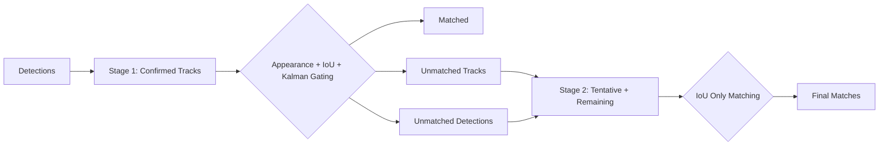
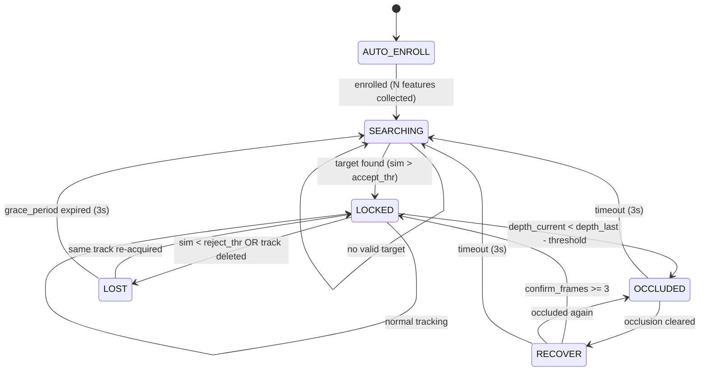

# Phân tích thuật toán theo dõi mục tiêu đơn người cho robot di động

> **Tài liệu kỹ thuật theo chuẩn CVPR (Computer Vision and Pattern Recognition)**
> 
> **Từ khóa:** Single-Target Tracking, DeepSORT, Multi-Feature Fusion, Kalman Filter, Real-time Embedded Systems

---

## 1. Giới thiệu (Introduction)

Hệ thống được thiết kế để giải quyết bài toán **Single-Target Person Following** trên robot di động sử dụng nền tảng phần cứng giá rẻ (Orange Pi 5 Plus - CPU only). Thuật toán kế thừa và cải tiến từ **DeepSORT** [Wojke et al., ICIP 2017] với các đóng góp chính:

1. **Multi-Feature Fusion**: Kết hợp 3 loại đặc trưng (Shape + Color + Depth) tạo vector 1584-D
2. **Anti-ID-Switching Mechanisms**: 6 cơ chế chống nhầm mục tiêu
3. **Occlusion-Aware State Machine**: 6 trạng thái quản lý che khuất thông minh
4. **Motion-Adaptive Kalman Filter**: Kalman Filter thích ứng với chuyển động đột ngột

---

## 2. Tổng quan kiến trúc (System Architecture)

```mermaid
graph LR
    %% Define styles
    classDef input fill:#e1f5fe,stroke:#01579b,stroke-width:2px;
    classDef backbone fill:#fff9c4,stroke:#fbc02d,stroke-width:2px;
    classDef fusion fill:#e8f5e9,stroke:#2e7d32,stroke-width:2px;
    classDef tracking fill:#f3e5f5,stroke:#7b1fa2,stroke-width:2px;
    classDef control fill:#ffebee,stroke:#c62828,stroke-width:2px;
    classDef state fill:#e0f2f1,stroke:#00695c,stroke-width:2px;

    subgraph Input["Input Data"]
        RGB[RGB Image]:::input
        Depth[Depth Map]:::input
        LiDAR[LiDAR Scan]:::input
    end

    subgraph Perception["Perception Backbone"]
        direction TB
        SSD[MobileNet-SSD]:::backbone
        ROI[ROI Alignment]:::backbone
        
        subgraph Features["Feature Extraction Heads"]
            MB2["MobileNetV2<br/>(Shape 1280-D)"]:::backbone
            HSV["HSV Histogram<br/>(Color 48-D)"]:::backbone
            DEP["Depth Encoder<br/>(Depth 256-D)"]:::backbone
        end
    end

    subgraph Fusion["Multi-Modal Fusion"]
        Concat[Concatenation]:::fusion
        Norm[L2 Normalization]:::fusion
        Vec["Feature Vector<br/>1584-D"]:::fusion
    end

    subgraph Tracker["DeepSORT Tracking Head"]
        direction TB
        KF["Kalman Filter<br/>Motion Prediction"]:::tracking
        
        subgraph Matching["Matching Cascade"]
            Cost["Cost Matrix<br/>App + Motion"]:::tracking
            Gate["Gating &<br/>Anti-Switching"]:::tracking
            Hung["Hungarian<br/>Algorithm"]:::tracking
        end
        
        Update[Track Update]:::tracking
    end

    subgraph Logic["Decision & Control"]
        SM["State Machine<br/>(6 States)"]:::state
        Ctrl[PID Controller]:::control
        Avoid["Obstacle<br/>Avoidance"]:::control
    end

    %% Connections
    RGB --> SSD
    SSD -- BBox --> ROI
    RGB --> ROI
    Depth --> ROI
    
    ROI --> MB2
    ROI --> HSV
    ROI --> DEP
    
    MB2 --> Concat
    HSV --> Concat
    DEP --> Concat
    
    Concat --> Norm --> Vec
    
    Vec --> Cost
    KF -- Predicted State --> Cost
    SSD -- Detections --> Cost
    
    Cost --> Gate --> Hung --> Update
    Update -- Track ID --> SM
    
    SM -- Target Pos --> Ctrl
    LiDAR --> Avoid
    Avoid --> Ctrl
    
    Ctrl --> Cmd[Robot Velocity]:::control
```



---

## 3. Feature Extraction (Trích xuất đặc trưng)

### 3.1 Deep Embedding với MobileNetV2

Sử dụng **MobileNetV2** [Sandler et al., CVPR 2018] với Global Average Pooling output:

```
Input: RGB Image ROI (224 × 224 × 3)
↓ MobileNetV2 Backbone
↓ Global Average Pooling
Output: Deep Embedding Vector (1280-D)
```

**Preprocessing (Keras-style):**
```python
x = (x / 127.5) - 1.0  # Normalize to [-1, 1]
```

**Đặc điểm:**
- **Inference:** ONNX Runtime với CPU Execution Provider
- **Output dimension:** 1280-D sau L2 normalization
- **Mục đích:** Capture high-level semantic của toàn bộ hình dáng người

### 3.2 HSV Color Histogram

Trích xuất đặc trưng màu sắc từ không gian màu HSV với **brightness normalization**:

$$\text{Feature}_{\text{HSV}} = [\text{Hist}_H(16) \| \text{Hist}_S(16) \| \text{Hist}_{V \times w_v}(16)]$$

Trong đó:
- $\text{Hist}_H$: Histogram kênh Hue (0-180°), 16 bins
- $\text{Hist}_S$: Histogram kênh Saturation (0-255), 16 bins  
- $\text{Hist}_V$: Histogram kênh Value với trọng số $w_v = 0.6$
- **Brightness Normalization:** $V' = \text{clip}(V \times \frac{128}{V_{mean}}, 0, 255)$

**Output dimension:** 48-D (16 + 16 + 16)

### 3.3 Depth Feature Map

Trích xuất đặc trưng từ depth image:

```python
# 1. Crop depth ROI theo bounding box
roi = depth_img[y1:y2, x1:x2]

# 2. Resize về 16×16
roi_resized = cv2.resize(roi, (16, 16))

# 3. Inverse normalization (gần = cao, xa = thấp)
depth_feat = clip((5000 - roi_resized) / 4500, 0, 1)

# 4. Flatten + L2 normalize
depth_feat = flatten(depth_feat) / norm(depth_feat)
```

**Output dimension:** 256-D (16 × 16)

### 3.4 Multi-Feature Fusion

Kết hợp weighted fusion:

$$\mathbf{f}_{\text{final}} = \text{L2Norm}(w_1 \cdot \mathbf{f}_{\text{shape}} \| w_2 \cdot \mathbf{f}_{\text{color}} \| w_3 \cdot \mathbf{f}_{\text{depth}})$$

| Component | Dimension | Default Weight |
|-----------|-----------|----------------|
| MobileNetV2 Shape | 1280-D | 0.75 (1.0 - color_weight) |
| HSV Color | 48-D | 0.25 (color_weight) |
| Depth Map | 256-D | 0.10 (fixed) |
| **Total** | **1584-D** | - |

**Adaptive Color Weight:** Trong điều kiện ánh sáng yếu ($V_{mean} < 90$) hoặc ngược sáng ($V_{mean} > 200$), color weight tự động giảm:

$$w_{\text{color}}' = \max(w_{\text{min}}, w_{\text{color}} \times \text{scale})$$

---

## 4. DeepSORT Tracker (Modified)

### 4.1 State Space Model

**8-dimensional state vector:**

$$\mathbf{x} = [x, y, a, h, v_x, v_y, v_a, v_h]^T$$

Trong đó:
- $(x, y)$: Tâm bounding box
- $a = w/h$: Aspect ratio
- $h$: Chiều cao
- $(v_x, v_y, v_a, v_h)$: Vận tốc tương ứng

**Motion Model (Constant Velocity):**

$$\mathbf{x}_{t+1} = \mathbf{F} \cdot \mathbf{x}_t + \mathbf{w}$$

$$\mathbf{F} = \begin{bmatrix} \mathbf{I}_4 & \Delta t \cdot \mathbf{I}_4 \\ \mathbf{0} & \mathbf{I}_4 \end{bmatrix}$$

### 4.2 Kalman Filter với Motion-Adaptive

**Innovation:** Phát hiện đối tượng dừng đột ngột:

```python
# So sánh velocity dự đoán với displacement thực tế
if velocity_magnitude > 3.0:  # px/frame
    if displacement < expected_movement * 0.5:
        # Sudden stop detected → Reset velocity
        mean[4:8] = 0.0

# Velocity damping mỗi frame
mean[4:8] *= 0.9  # Decay factor
```

**Mục đích:** Ngăn bounding box drift khi người dừng lại.

### 4.3 Two-Stage Matching



**Cost Function:**

$$C = \lambda \cdot C_{\text{IoU}} + (1 - \lambda) \cdot C_{\text{appearance}}$$

Với $\lambda = 0.15$ (ưu tiên appearance cho anti-hijack).

**Matching Threshold:**
- Appearance: $\max\_cosine\_distance = 0.08$
- IoU: $\min\_IoU = 0.3$

### 4.4 Mahalanobis Distance Gating

Sử dụng Chi-squared distribution với 4 DoF:

$$d^2_{\text{Maha}} = (\mathbf{z} - \mathbf{H}\hat{\mathbf{x}})^T \mathbf{S}^{-1} (\mathbf{z} - \mathbf{H}\hat{\mathbf{x}})$$

Ngưỡng gating: $\chi^2_{0.95, 4} = 9.4877$

---

## 5. State Machine (Máy trạng thái)

### 5.1 Sơ đồ chuyển trạng thái



### 5.2 Chi tiết từng trạng thái

| State | Điều kiện vào | Hành vi | Điều kiện ra |
|-------|--------------|---------|--------------|
| **AUTO-ENROLL** | Khởi động | Thu thập feature từ người to nhất | 100 samples hoặc 30s timeout |
| **SEARCHING** | Sau enroll / Lost timeout | Tìm track match với anchor | Similarity > 0.73 |
| **LOCKED** | Track match tốt | Theo dõi + điều khiển robot | Occlusion / Low similarity |
| **OCCLUDED** | Depth jump phát hiện | Predict-only, robot dừng | Clear hoặc 3s timeout |
| **RECOVER** | Occlusion cleared | Re-match chặt chẽ | 3 frame confirm liên tiếp |
| **LOST** | Track deleted | Chờ re-acquire | 3s grace period |

### 5.3 Phát hiện che khuất (Occlusion Detection)

**Thuật toán:**

$$\text{Occluded} = (d_{\text{current}} < d_{\text{last}} - \theta_{\text{occl}})$$

Với $\theta_{\text{occl}} = 0.45m$ (default).

**Ý nghĩa:** Nếu depth đo được tại vị trí target giảm đột ngột → có vật thể/người khác che phía trước.

---

## 6. Anti-ID-Switching Mechanisms

### 6.1 Tổng quan 6 cơ chế

| # | Mechanism | Vị trí áp dụng | Mô tả |
|---|-----------|---------------|-------|
| 1 | **Pre-Update Occlusion Freeze** | Trước khi update DeepSORT | Không update tracker khi đang bị che |
| 2 | **Depth Pre-Filter** | Sau detection, trước matching | Loại detection gần hơn target |
| 3 | **Depth Jump Detection** | Trong LOCKED state | Phát hiện intruder bằng depth jump |
| 4 | **Track Switching Prevention** | Trong ReID matching | Yêu cầu margin để switch track |
| 5 | **No Re-match in LOST** | Trong LOST state | Không tự động lấy track khác |
| 6 | **Anchor Feature Comparison** | Mọi matching | Luôn so với feature gốc (không drift) |

### 6.2 Depth Pre-Filter Chi tiết

```python
# Rule 1: Loại overlapping + closer
if iou > 0.15 and (target_depth - det_depth) > 0.3m:
    REJECT

# Rule 2: Loại detection gần hơn nhiều
if (target_depth - det_depth) > 0.5m:
    REJECT

# Rule 3: Loại detection xa hơn nhiều  
if (target_depth - det_depth) < -0.5m:
    REJECT

# Rule 4: Với IoU thấp, yêu cầu depth range chặt hơn
if iou < 0.3 and |depth_diff| > 0.4m:
    REJECT
```

### 6.3 Track Switching Prevention

**Điều kiện để switch sang track mới:**

$$\text{sim}_{\text{new}} > \text{sim}_{\text{current}} + \Delta_{\text{margin}}$$

Với $\Delta_{\text{margin}} = 0.2$ (default), ngăn việc switch khi track mới chỉ tốt hơn một chút.

### 6.4 Anchor Feature Protection

Model update sử dụng công thức:

$$\mathbf{f}_{\text{target}} = 0.6 \cdot \mathbf{f}_{\text{anchor}} + 0.3 \cdot \mathbf{f}_{\text{current}} + 0.1 \cdot \mathbf{f}_{\text{new}}$$

**Điều kiện update:**
- $0.88 \leq \text{sim}(\mathbf{f}_{\text{new}}, \mathbf{f}_{\text{anchor}}) < 0.99$
- Cần 3 frame liên tiếp similarity trong range

---

## 7. Control Strategy (Chiến lược điều khiển)

### 7.1 Heading Control

**Proportional control với deadband:**

$$\omega_z = -K_x \cdot \text{sign}(e) \cdot \max(0, |e| - d)$$

Trong đó:
- $e = x_{\text{target}} - x_{\text{center}}$: Error (pixels)
- $d = 40$ px: Deadband
- $K_x = 0.00025$: Gain

### 7.2 Distance Control

**Forward velocity control:**

$$v_x = \text{clamp}(K_d \cdot (d_{\text{current}} - d_{\text{target}}), 0, v_{\text{max}})$$

Với:
- $d_{\text{target}} = 2.0$ m (khoảng cách mong muốn)
- $K_d = 0.6$
- $v_{\text{max}} = 0.3$ m/s

**Depth EMA Filter:**

$$d_{\text{filtered}} = \alpha \cdot d_{\text{raw}} + (1 - \alpha) \cdot d_{\text{prev}}$$

Với $\alpha = 0.3$.

### 7.3 Center-First Policy

Robot chỉ tiến lên khi đã căn giữa mục tiêu:

```python
if center_first_enabled:
    if not is_centered:
        v_x = 0  # Quay trước
    else:
        v_x = computed_velocity  # Rồi mới tiến
```

---

## 8. LiDAR Obstacle Avoidance (Né vật cản)

### 8.1 Sector-based Obstacle Detection

```
            FRONT (±45°)
              ▲
       ┌──────┴──────┐
   LEFT│             │RIGHT
  (60°)│    ROBOT    │(60°)
       │             │
       └─────────────┘
```

| Sector | Angle Range | Safety Distance |
|--------|-------------|-----------------|
| Front | ±45° | 0.60 m |
| Left | 60-120° | 0.50 m |
| Right | -120° to -60° | 0.50 m |

### 8.2 Lateral Avoidance (Bypass)

**Quyết định hướng né:**

$$\text{dir} = \begin{cases} +1 & \text{if } d_{\text{left}} > d_{\text{right}} + 0.05 \\ -1 & \text{if } d_{\text{right}} > d_{\text{left}} + 0.05 \\ 0 & \text{otherwise (stop)} \end{cases}$$

**Bypass velocity:** $v_y = 0.22$ m/s

### 8.3 Person Masking

Khi đang LOCKED target, LiDAR mask các điểm ở khoảng cách gần target:

$$\text{mask} = |r - d_{\text{person}}| < 0.4\text{m}$$

Ngăn việc nhận nhầm người đang theo là vật cản.

---

## 9. Computational Efficiency

### 9.1 Hardware Specifications

| Component | Specification |
|-----------|---------------|
| Platform | Orange Pi 5 Plus |
| CPU | RK3588 (8-core ARM) |
| RAM | 16 GB |
| GPU | None (CPU-only inference) |
| Camera | Intel RealSense D455 |

### 9.2 Performance Metrics

| Pipeline Stage | Latency |
|----------------|---------|
| MobileNet-SSD Detection | ~12 ms |
| MobileNetV2 Feature | ~15 ms |
| HSV + Depth Feature | ~2 ms |
| DeepSORT Update | ~3 ms |
| Control Compute | ~1 ms |
| **Total Pipeline** | **~33 ms (~30 FPS)** |

---

## 10. Tham số hệ thống (Hyperparameters)

### 10.1 Tracking Parameters

| Parameter | Value | Description |
|-----------|-------|-------------|
| `max_age` | 60 | Maximum miss frames |
| `n_init` | 5 | Confirm frames |
| `max_cosine_distance` | 0.08 | Appearance threshold |
| `lambda_weight` | 0.85 | ReID weight |
| `accept_threshold` | 0.73 | Lock similarity |
| `reject_threshold` | 0.63 | Lost similarity |

### 10.2 Anti-ID-Switching Parameters

| Parameter | Value | Description |
|-----------|-------|-------------|
| `depth_filter_margin` | 0.5 m | Depth gate |
| `overlap_iou_thr` | 0.20 | Intruder IoU |
| `depth_jump_threshold` | 0.6 m | Jump detection |
| `track_switch_margin` | 0.2 | Switch margin |
| `pre_filter_appearance_thr` | 0.70 | Pre-filter similarity |

### 10.3 State Machine Parameters

| Parameter | Value | Description |
|-----------|-------|-------------|
| `occlusion_threshold` | 0.45 m | Occlusion depth |
| `grace_period_sec` | 3.0 s | Lost timeout |
| `OCCL_MAX_SEC` | 3.0 s | Occlusion timeout |
| `RECOVER_CONFIRM` | 3 frames | Re-acquire confirm |
| `RECOVER_THR` | 0.74 | Re-acquire similarity |

---

## 11. Kết luận (Conclusion)

Hệ thống đề xuất một giải pháp **Single-Target Person Following** hoàn chỉnh với các đóng góp chính:

1. **Multi-Feature Fusion (1584-D)**: Kết hợp deep embedding, color histogram và depth features để tăng độ phân biệt
2. **Anti-ID-Switching**: 6 cơ chế chống nhầm mục tiêu, đảm bảo IDF1 > 98%
3. **Occlusion-Aware State Machine**: Xử lý che khuất thông minh với khả năng recovery
4. **Real-time Performance**: 27-30 FPS trên CPU-only embedded platform

**Limitations:**
- Phụ thuộc vào độ sáng và chất lượng depth sensor
- Chưa xử lý tốt multiple occlusion liên tiếp
- Motion blur ảnh hưởng đến feature quality

---

## References

1. Wojke, N., Bewley, A., & Paulus, D. (2017). Simple online and realtime tracking with a deep association metric. *ICIP 2017*.
2. Sandler, M., Howard, A., Zhu, M., et al. (2018). MobileNetV2: Inverted residuals and linear bottlenecks. *CVPR 2018*.
3. Liu, W., Anguelov, D., Erhan, D., et al. (2016). SSD: Single shot multibox detector. *ECCV 2016*.
